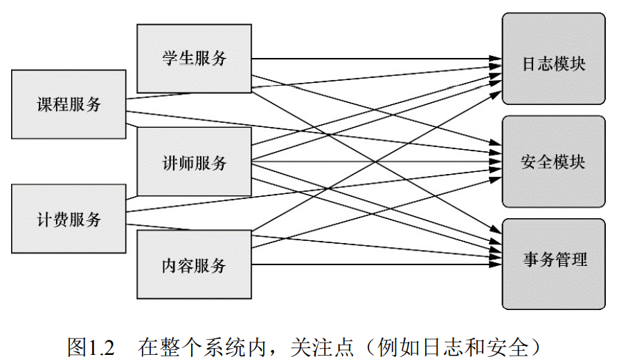
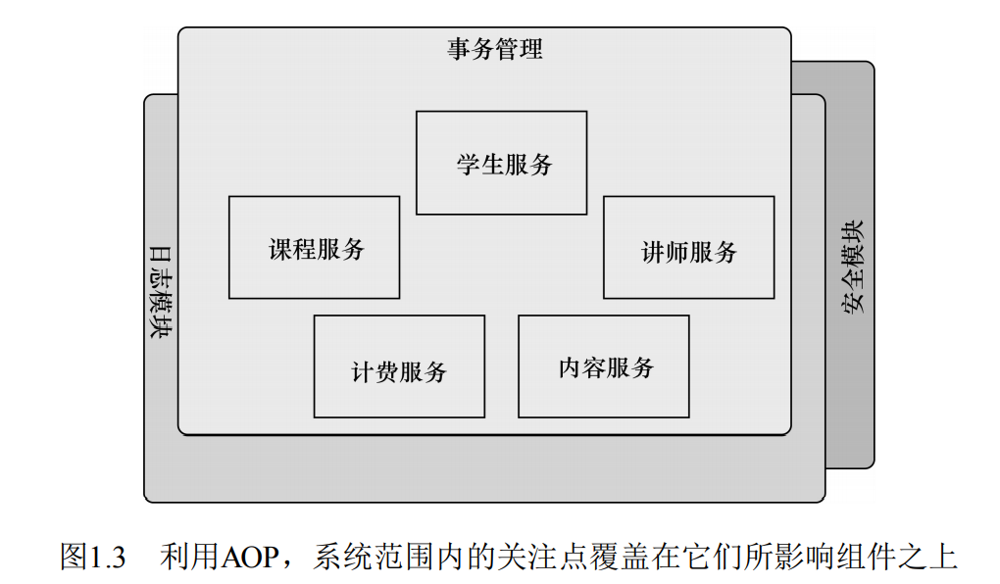
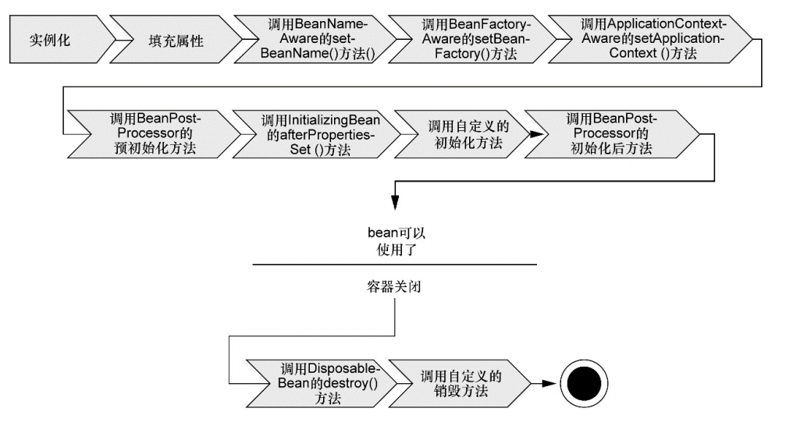
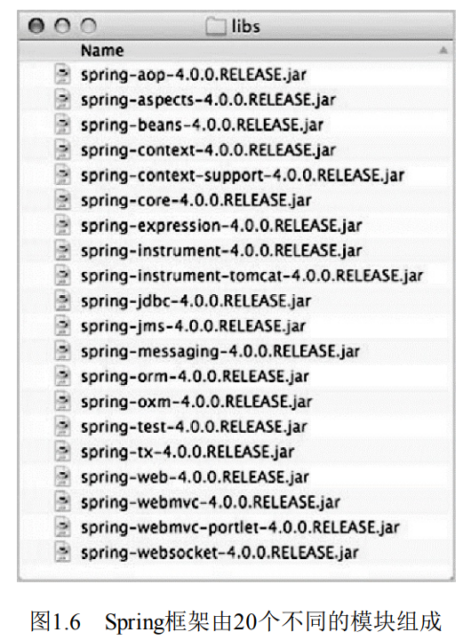
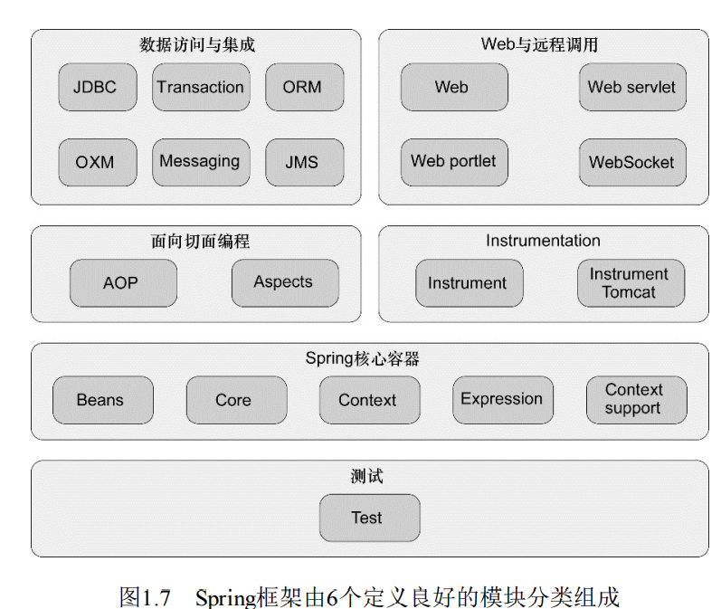

## LearnSpring  

spring功能的底层依赖于两个核心特性：  
- 依赖注入：(dependency injection,DI)  
- 面向切面编程：(aspect-oriented programming,AOP)  

### 简化Java开发  

spring旨在简化开发，采用了以下4个策略：  
- 基于POJO的轻量级以及**最小侵入**式编程。  
- 通过依赖注入和面向接口实现**松耦合**。  
- 基于切面和惯例进行**声明式**编程。  
- 通过切面和模板**减少样板代码**。  

POJO:  
>POJO(Plain Ordinary Java Object)简单的Java对象，实际就是普通JavaBeans，是为了避免和EJB混淆所创造的简称。  
>其中有一些属性及其getter setter方法的类,没有业务逻辑，有时可以作为VO(value -object)或dto(Data Transform Object)来使用。  
>当然,如果你有一个简单的运算属性也是可以的,但不允许有业务方法,也不能携带有connection之类的方法。  

侵入式开发与非侵入式开发：  
>侵入式的做法就是要求用户代码“知道”框架的代码，表现为用户代码需要继承框架提供的类。  
>非侵入式则不需要用户代码引入框架代码的信息，从类的编写者角度来看，察觉不到框架的存在。  
>
>使用struts时，需要继承一些struts的类，这时struts侵入到了我的代码里。  
>使用spring时，编写一些业务类的时候不需要继承spring特定的类，通过配置完成依赖注入后就可以使用，此时，spring就没有侵入到我业务类的代码里。  
>
>侵入式让用户代码产生对框架的依赖，这些代码不能在框架外使用，不利于代码的复用（缺点）。  
>但侵入式可以使用户跟框架更好的结合，更容易更充分的利用框架提供的功能（优点）。  
>非侵入式的代码则没有过多的依赖，可以很方便的迁移到其他地方。但是与用户代码互动的方式可能就比较复杂。  

声明式编程：  
>声明式编程（英语：Declarative programming）是一种编程范式，与命令式编程相对立。它描述目标的性质，让计算机明白目标，而非流程。  

#### 激发POJO的潜能  

很多框架通过强迫应用继承它们的类或实现它们的接口从而导致应用与框架绑死。    
Spring竭力避免因自身的API而弄乱你的应用代码：  
Spring不会强迫你实现Spring规范的接口或继承Spring规范的类。  
>相反，在基于Spring构 建的应用中，它的类通常没有任何痕迹表明你使用了Spring。  
>最坏的 场景是，一个类或许会使用Spring注解，但它依旧是POJO。 
 
Spring的非侵入编程模型意味着一个普通类在Spring应用和非Spring应用中都可以**发挥同样的作用**。  
Spring赋予POJO魔力的**方式之一**就是通过**DI来装配**它们。  

#### 依赖注入  

传统的做法，每个对象负责管理与自己相互协作的对象：这将会导致**高度耦合**和**难以测试**的代码。  
通过DI，对象的依赖关系将由系统中负责协调各对象的**第三方组件**在创建对象的时候**进行设定**：对象无需自行创建或管理它们的依赖关系。

依赖注入：构造器注入
- 如果一个对象**只通过接口**（而不是具体实现或初始化过程）来表明依赖关系，
- 那么这种依赖就能够在对象本身毫不知情的情况下，**用不同的具体实现进行替换**。

装配：  
- 创建应用组件之间协作的行为通常称为装配（wiring）。  
- Spring有多种装配bean的方式：  
    - 采用XML是很常见的一种装配方式，如knight.xml。
    - 基于Java的配置，如KnightConfig类。  
    
应用上下文：
- Spring通过 **应用上下文(Application Context)** 装载bean的定义并把它们组装起来。Spring应用上下文**全权负责**对象的**创建和组装**。  
- Spring自带了多种应用上下文的实现，它们之间主要的**区别**仅仅在于如何**加载配置**。  
- `ClassPathXmlApplicationContext`: 加载位于应用程序类路径下一个或多个**XML配置文件**。

#### 应用切面  

DI能够让相互协作的软件组件保持松散耦合，
而面向切面编程(aspect-oriented programming，AOP)允许你把**遍布应用各处**的功能**分离出来**形成可重用的组件。

横切关注点：
>面向切面编程往往被定义为促使软件系统实现关注点的分离一项技
 术。  
>系统由许多不同的组件组成，每一个组件各负责一块特定功能。  
>除了实现自身核心的功能之外，这些组件还经常承担着额外的职责。  
>诸如日志、事务管理和安全这样的系统服务经常融入到自身具有核心
 业务逻辑的组件中去，  
>这些系统服务通常被称为**横切关注点**，因为它们会**跨越系统的多个组件**。

分散关注点的弊端:  
>- 实现系统关注点功能的**代码将会重复出现**在多个组件中。这意味着如果你要改变这些关注点的逻辑，必须**修改各个模块中的相关实现**。  
>即使你把这些关注点抽象为一个独立的模块，其他模块只是调用它的方法，但**方法的调用还是会重复**出现在各个模块中。
>- 组件会因为那些与自身核心业务无关的代码而**变得混乱**。  
>一个向地址簿增加地址条目的方法应该只关注如何添加地址，而不应该关注它是不是安全的或者是否需要支持事务。



AOP**确保POJO的简单性**:
- AOP能够使这些**服务模块化**，并以**声明的方式**将它们应用到它们需要影响的组件中去。  
- 所造成的结果就是这些组件会具有**更高的内聚性**并且会**更加关注自身的业务**，完全不需要了解涉及系统服务所带来复杂性。  
- 总之，AOP能够**确保POJO的简单性**。  

>如图1.3所示，我们可以把切面想象为覆盖在很多组件之上的一个外壳。应用是由那些实现各自业务功能的模块组成的。   
>借助AOP，可以使用各种功能层去包裹核心业务层。这些层**以声明的方式灵活地应用**到系统中，  
>你的**核心应用甚至根本不知道它们的存在**。这是一个非常强大的理念，可以将安全、事务和日志关注点与核心业务逻辑相分离。   

  

声明切面：  
使用了Spring的aop配置命名空间把Minstrel bean声明为一个切面。  
1. 首先需要把`Minstrel`声明为一个`bean`。  
2. 然后在`<aop:aspect>`元素中引用该`bean`
3. `<aop:pointcut>`元素定义切入点
4. `<aop:before>`定义前置通知，在`embarkOnQuest()`执行前调用`singBeforeQuest()`
5. `<aop:after>`定义后置通知，在`embarkOnQuest()`执行后调用`singAfterQuest()`

>首先，Minstrel仍然是一个POJO，没有任何代码表明它要被作为一个切面使用。  
>当我们按照上面那样进行配置后，在Spring的上下文中，Minstrel实际上已经变成一个切面了。  
>其次，也是最重要的，Minstrel可以被应用到BraveKnight中，而BraveKnight不需要显式地调用它。  
>实际上，BraveKnight完全不知道Minstrel的存在。  

注意：
>必须还要指出的是，尽管我们使用Spring魔法把Minstrel转变为一个切面，
>但首先要把它声明为一个Spring bean。
>能够为其他Spring bean做到的事情都可以同样应用到Spring切面中，例如为它们注入依
赖。

#### 使用模板消除样板代码  

样板式代码：  
- 为了实现**通用和简单**的任务，常常不得一遍编地重复编写这些代码。  
- 例如JDBC中，只有少量的代码与查询员工逻辑有关系，其他的代码**都是JDBC的样板代码**。  

Spring旨在通过模板封装来消除样板式代码：  
- Spring的JdbcTemplate使得执行数据库操作时，避免传统的JDBC样板代码成为了可能。
- 使用Spring的JdbcTemplate（利用了 Java 5特性的JdbcTemplate实现）重写的getEmployeeById()方法仅仅关注于获取员工数据的核心逻辑。

```java
public class Employee{
    public Employee getEmployeeById(long id){
        Connection conn = null;
        PrepareStatement stmt = null;
        ResultSet rs = null;
        try{
            conn = dataSource.getConnection();
            //查找员工
            stmt = conn.prepareStatement("select id, firstname, lastname, salary from employee where id=?");
            stmt.setLong(1, id);
            rs = stmt.executeQuery();
            Employee employee = null;
            //根据数据创建对象
            if(rs.next()){
               employee = new Employee();
               employee.setId(rs.getLog("id"));
               employee.setFirstName(rs.getString("firstname"));
               employee.setLastName(rs.getstring("lastname"));
               employee.setSalary(rs.getBigDecimal("salary"));
            }
            return employee;
        }catch(SQLEXCeption e){
            e.printStackTrace();
        }finally{
            //清理
            if(rs!=null){
                try{
                    rs.close();
                }catch(SQLException e){ 
                    e.printStackTrace();
                }
            }
            if(stmt != null){
                try{
                    stmt.close();
                }catch(SQLException e){
                    e.printStackTrace();
                }
            }
            if(conn != null){
                try{
                    conn.close();
                }catch(SQLException e){
                    e.printStackTrace();
                }
            }
        }
    }
}
//消除样板代码
public class Employee{
    public Employee getEmployeeById(long id){
        return jdbcTemplate.queryForObject(
                "select id, firstname, lastname, salary from employee where id=?",//SQL查询
                new RowMapper<Employee>(){
                    public Employee mapRow(ResultSet rs, int rowNum) throws SQLException{//将结果匹配为对象
                        Employee employee = new Employee();
                        employee.setId(rs.getLog("id"));
                        employee.setFirstName(rs.getString("firstname"));
                        employee.setLastName(rs.getstring("lastname"));
                        employee.setSalary(rs.getBigDecimal("salary"));
                        return employee;
                    } 
                }
                , id);//指定查询参数
    }
}
```

### 容纳你的Bean

spring容器：基于spring的应用，你的应用对象都是生存于spring容器。  
- spring容器负责创建对象，装配它们，配置并管理它们的整个生命周期。  
- 容器是spring框架的核心。
- 容器使用DI管理构成应用的组件，它会创建互相协作组件之间的关联。  
>毫无疑问，这些对象更简单干净，更易于理解，更易于重用并且更易于进行单元测试。 

容器的实现与类型：归为两种类型
- bean工厂(`org.springframework.beans.factory.beanFactory`)：最简单的容器，提供**基本的DI支持**。  
- 应用上下文(`org.springframework.context.ApplicationContext`)：基于`beanFactroy`构建，提供应用框架级的服务。  
>从属性文件解析文本信息以及发布应用事件给感兴趣的事件监听者。 

#### 应用上下文  
应用上下文：  
- `AnnotationConfigApplicationContext`：从一个或多个**Java配置类**中加载Spring应用上下文。 
- `AnnotationConfigWebApplicationContext`：从一个或多个**Java配置类**中加载Spring **Web应用**上下文。  
- `ClassPathXmlApplicationContext`：从所有**类路径**(包括jar文件)中加载一个或多个**XML配置文件**中加载上下文定义，把应用上下文的定义文件作为资源。  
- `FileSystemXmlApplicationContext`：从**文件系统**下的一个或多个**XML配置**文件中加载上下文定义。  
- `XmlWebApplicationContext`：从**Web应用**下的一个或多个**XML配置文件**中加载上下文定义。  

获取bean： 
- 应用上下文准备就绪后就可以调用`getbean(Class cl)`从容器中获取bean。  

#### bean的生命周期  

bean的生命周期：
- 传统的Java应用中，bean的生命周期很简单：实例化->使用->不使用->自动垃圾回收。  
- Spring容器中的bean的生命周期就显得**相对复杂**多了。  
- 正确理解Spring bean的生命周期非常重要，因为你或许要利用Spring提供的**扩展点来自定义bean的创建过程**。  

  

bean的生命周期各个阶段：
1．Spring对bean进行**实例化**。  
2．Spring将**值和bean的引用**注入到bean对应的**属性**中。  
3．如果bean实现了`BeanNameAware`接口，Spring将bean的`ID`传递给`setBeanName()`方法。  
4．如果bean实现了`BeanFactoryAware`接口，Spring将调用`setBeanFactory()`方法，将`BeanFactory`容器实例传入。  
5．如果bean实现了`ApplicationContextAware`接口，Spring将调用`setApplicationContext()`方法，将bean所在的**应用上下文的引用**传入进来。  
6．如果bean实现了`BeanPostProcessor`接口，Spring将调用它们的`postProcessBeforeInitialization()`方法。  
7．如果bean实现了`InitializingBean`接口，Spring将调用它们的`afterPropertiesSet()`方法。 
    >类似地，如果bean使用`initmethod`声明了初始化方法，该方法也会被调用。  
8．如果bean实现了`BeanPostProcessor`接口，Spring将调用它们的`postProcessAfterInitialization()`方法。  
9．此时，bean已经准备就绪，可以被应用程序使用了，它们将一直驻留在应用上下文中，直到该应用上下文被销毁。  
10．如果bean实现了`DisposableBean`接口，Spring将调用它的`destroy()`接口方法。  
    >同样，如果bean使用`destroy-method`声明了销毁方法，该方法也会被调用。  
 
 ### 俯瞰Spring风景线  
 
 在Spring框架的范畴内，你会发现Spring简化Java开发的多种方式。  
 但在Spring框架之外还存在一个构建在核心框架之上的庞大生态圈，  它将Spring扩展到不同的领域，例如Web服务、REST、移动开发以及NoSQL。  
 
 #### Spring模块
 
 在Spring 4.0中，Spring框架的发布版本包括了20个不同的模块，每个模块会有3个JAR文件（二进制类库、源码的JAR文件以及
 JavaDoc的JAR文件）。  
 完整的库JAR文件如图所示：  
   
 
 这些模块依据其所属的功能可以划分为6类不同的功能，如图所示：  
   
 
 - Spring核心容器:  容器是Spring框架最核心的部分，它管理着Spring应用中bean的创建、配置和管理。  
 - Spring的AOP模块: AOP可以帮助应用对象解耦。  
 - 数据访问与集成： Spring的JDBC和DAO（Data Access Object）模块抽象了这些样板式代码，使我们的数据库代码变得简单明了。
 - Web与远程调用： MVC（Model-View-Controller）模式是一种普遍被接受的构建Web应用的方法，它可以帮助用户将界面逻辑与应用逻辑分离。  
 - Instrumentation： Spring的Instrumentation模块提供了为JVM添加代理（agent）的功能。  
    >具体来讲，它为Tomcat提供了一个织入代理，能够为Tomcat传递类文件，就像这些文件是被类加载器加载的一样。  
 - 测试：鉴于开发者自测的重要性，Spring提供了测试模块以致力于Spring应用的测试。  

### Spring Portfolio  
整个Spring Portfolio包括多个构建于核心Spring框架之上的框架和类库。  
概括地讲，整个Spring Portfolio几乎为每一个领域的Java开发都提供了Spring编程模型。  


                                                                        