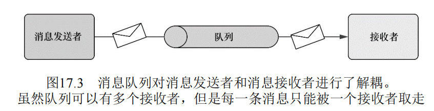

## Spring 消息  

### 消息基础知识  

**消息的异步性和间接性**：  
> 消息是异步发送的。 
> 异步消息是一个应用程序向另一个应用程序间接发送消息的一种方式，这种方式无需等待 对方的响应。  
> 间接性是异步消息的关键。   
> 发送方的 应用程序会将消息交给一个服务，由服务确保将消息投递给接收方应 用程序。  

**消息的主要概念**： 
- 消息代理：  当一个应用发送消息时，会将消息发送给一个异步代理。  
- 目的地：  消息代理可以确保消息被投递到目的地，同时解放发送者，使其能进行其他的业务。  
> 消息 中的目的地相对来说并不那么具体。  
> 目的地只关注消息应该从哪里获 得——而不关心是由谁取走消息的。  
> 这种情况下，目的地就如同信件的收件人为“本地居民。  

**消息的路由模式**：  
- 队列(queue)： 关联点对点模型。  
- 主题(topic)： 关联发布/订阅模型。  
> 尽管不同的消息系统会提供不同的消息路由模式，但是有两种通用的目的地。  
> 每种类型都与特定的消息 模型相关联，分别是点对点模型（队列）和发布/订阅模型（主题）。 

**点对点消息模型**：  
- 一条消息只有一个发送者和接受者。 
    > 在点对点模型中，每一条消息都有**一个**发送者和**一个**接收者。  
    > 当消息代理得到消息时，它将消息放入一个队列中。   
    > 当接收者请求队列中的下一条消息时，消息会从队列中取出，并投递给接收者。 
- 可以使用多个接收者来处理队列的消息。 
    > 在点对点的消息中，如果有多个接收者监听队列，则无法知道某条特定的消息会由哪一个接收者处理。  
    > 这种不确定性实际上有 很多好处，因为我们只需要简单地为队列添加新的监听器就能提高应用的消息处理能力。  



**发布/订阅模型**：  
- 消息只会发送给主题。  
- 多个接收者都可以监听同一个主题。  
- (与队列模型不同处)主题的所有订阅者都会接受到消息的副本。  
> 发布者只知道它的消息要发送到一个特定的主题 ——而不知道有谁在监听这个主题。   

 

**主题需要提前订阅**： 
- 队列模式：消费者不需要提前订阅也可以消费消息。 
- 主题模式：只有提前进行订阅的消费者才能成功消费消息

**异步消息的优点**：  
- 无需等待：同步通信意味着等待。
- 面向消息解耦：客户端没有与特定的方法签名绑定。 
- 位置独立：消息客户端只需要了解通过哪个队列或主题来发送消息。   
- 确保投递： 即使服务不可用，消息也会储存起来，知道服务可以使用位置。 
 
**RPC同步通信的缺点**： 
- 同步通信意味着**等待**。  
- 客户端与远程服务的**服务接口耦合**：接口发生改变，此服务的所有客户端都要做相应的改变。  
- 客户端与远程服务的**位置耦合**：服务端地址发生改变，客户端也需要重新配置网络位置。 
- 客户端与服务的**可用性耦合**： 如果远程服务不可用，则客户端也无法正常运行。  

**位置独立性的利用**： 
- 在点对点模型中创建**服务集群**。  
- 发布/订阅模型中定义对同一消息的**不同的服务逻辑**。  
> 在点对点模型中，可以利用这种位置的独立性来创建服务的集群。  
> 在订阅发布模型中，多个服务可以订阅同一个主题，接收相同消息的副本，但是每一个服务对消息的处理逻辑却可能有所不同。  

**服务集群**： 
> 如果客户端不知道服务的位置，并且服务的唯一要求就是可以访问消息 代理，  
> 那么我们就可以配置多个服务从同一个队列中接收消息。  
> 如果 服务过载处理能力不足，我们只需要添加一些新的服务实例来监听相同的队列就可以了。  

**不同的服务逻辑**：  
> 假设我们有一组服务可以共同处理描述新员工信息的消息。  
> 一个服务可能会在工资系统中增加该员工，  
> 另一个服务则会将新员工增加到HR门户中，  
> 同时还有一个服务 为新员工分配可访问系统的权限。  
> 每一个服务都基于相同的数据（都 是从同一个主题接收的），但各自进行独立的处理。  

### 使用JMS发送消息  

**`JMS`**:  
> Java消息服务（Java Message Service ，JMS）是一个Java标准，  
> 定义了**使用消息代理**的**通用API**。   

**`JmsTemplate`**： 
> Spring通过基于模板的抽象为JMS功能提供了支持，这个模板也就 是JmsTemplate。  
> 使用JmsTemplate，能够非常容易地在消息生 产方发送队列和主题消息，在消费消息的那一方，也能够非常容易地 接收这些消息。  

**消息驱动POJO**:  
> Spring还提供了消息驱动POJO的理念：这是一个简单 的Java对象，  
> 它能够以异步的方式响应队列或主题上到达的消息。  

#### 在Spring中搭建消息代理  

**使用ActiveMQ消息代理**：  
1. 下载二进制发行包： 在开始使用ActiveMQ之前，我们需要从http://activemq.apache.org下载二进制发行包。    
2. 解压缩： 
3. 找到API的Jar文件并加入类路径：在解压目录中，我们会找到文件 activemq-core-5.9.1.jar。为了能够使用ActiveMQ的API，我们需要将 此JAR文件添加到应用程序的类路径中。  
4. 在对应操作系统的子目录下**运行启动脚本**：例如OS X下启动ActiveMQ，则在`/bin/macosx`目录下运行`activemq start`。 
> ActiveMQ是一个伟大的开源消息代理产品，也是使用JMS进行异步消息传递的最佳选择。  

```xml
<!-- 或者使用maven添加依赖 -->
<dependency>
    <groupId>org.apache.activemq</groupId>
    <artifactId>activemq-all</artifactId>
    <version>5.16.1</version>
</dependency>
 ```

**创建连接工厂**：  
> 都需要借助JMS连接工厂通过消息代理发送消息。  
> ActiveMQConnectionFactory是ActiveMQ自带的连 接工厂，在Spring中可以使用如下方式进行配置。  
> 默认情况下，ActiveMQConnectionFactory会假设ActiveMQ代理监听localhost的61616端口。  
> 可以使用brokerURL属性来指定代理的URL。 
> 有多种配置方式： 
- xml中配置`ActiveMQConnectionFactory`Bean: 
```xml
<bean id="connectionFactory"
    class = "org.apache.activemq.spring.ActiveMQConnectionFactory"
    p:brokerURL="tcp://localhost:61616"/>
```
- xml中使用`ActiveMQ`的Spring命名空间： 适用于ActiveMQ4.1之后的所用版本
```xml
<?xml version="1.0" encoding="UTF-8" ?>
<bean xmlns="http://www.springframework.org/schema/beans"
    xmlns:xsi="http://www.w3.org/2001/XMLSchema-instance"
    xmlns:jms="http://www.springframework.org/schema/jms"
    xmlns:amq="http://activemq.apache.org/schema/core"
    xsi:schemaLocation="http://activemq.apache.org/schema/core 
                        http://activemq.apache.org/schema/core/activemq-core.xsd  
                        http://www.springframework.org/schema/jms 
                        http://www.springframework.org/schema/jms/spring-jms.xsd
                        http://www.springframework.org/schema/beans 
                        http://www.springframework.org/schema/beans/spring-beans.xsd ">

    <amq:connectionFactory id="connectionFactory"
                        brokerURL="tcp://localhost:61616"/>
</bean>
```
```java
@Configuration
@ComponentScan
public class MessageConfiguration {

}
```

**声明ActiveMQ消息目的地**： 
> 除了连接工厂外，我们还需要消息传递的目的地。  
> 目的地可以是一个队列，也可以是一个主题，这取决于应用的需求。  
> 不论使用的是队列还是主题，我们都必须使用特定的消息代理实现类 在Spring中配置目的地bean。  
- xml配置代理实现类： 
```xml
<beans>
    <bean id="connectionFactory"
        class = "org.apache.activemq.spring.ActiveMQConnectionFactory"
        p:brokerURL="tcp://localhost:61616"/>
    <bean id="queue" class="org.apache.activemq.command.ActiveMQQueue">
        <constructor-arg value="app.queue"/><!--构造器参数定义队列的名称-->
    </bean>
    <bean id="topic" class="org.apache.activemq.command.ActiveMQTopic">
        <constructor-arg value="app.topic"/><!--构造器参数定义主题名-->
    </bean>
</beans>
```
- 使用ActiveMQ的Spring命名空间： 
```xml
<?xml version="1.0" encoding="UTF-8" ?>
<bean xmlns="http://www.springframework.org/schema/beans"
    xmlns:xsi="http://www.w3.org/2001/XMLSchema-instance"
    xmlns:jms="http://www.springframework.org/schema/jms"
    xmlns:amq="http://activemq.apache.org/schema/core"
    xsi:schemaLocation="http://activemq.apache.org/schema/core 
                        http://activemq.apache.org/schema/core/activemq-core.xsd  
                        http://www.springframework.org/schema/jms 
                        http://www.springframework.org/schema/jms/spring-jms.xsd
                        http://www.springframework.org/schema/beans 
                        http://www.springframework.org/schema/beans/spring-beans.xsd ">

    <amq:connectionFactory id="connectionFactory"
                        brokerURL="tcp://localhost:61616"/>
    <!-- physicalName 指定消息通道的名字-->
    <amq:queue id="queue" physicalName="app.queue"/>
    <amq:topic id="topic" physicalName="app.topic"/>
</bean>
```

#### 使用Spring的JMS模板  

**传统的JMS**: 
> 虽然JMS为所有的消息代理提供了统一的接口，但是这种接口用起来 并不是很方便。  
```java
package pers.mortal.learn.springintegration.message;

import org.apache.activemq.command.ActiveMQQueue;
import org.apache.activemq.command.ActiveMQTopic;
import org.apache.activemq.spring.ActiveMQConnectionFactory;
import org.junit.Test;
import org.junit.runner.RunWith;
import org.springframework.beans.factory.annotation.Autowired;
import org.springframework.test.context.ContextConfiguration;
import org.springframework.test.context.junit4.SpringJUnit4ClassRunner;

import javax.jms.*;

import static org.junit.Assert.*;

@RunWith(SpringJUnit4ClassRunner.class)
@ContextConfiguration(classes = {MessageConfiguration.class})
public class MessageConfigurationTest {
    @Autowired
    private ActiveMQConnectionFactory connectionFactory;

    @Autowired
    private ActiveMQQueue queue;

    @Autowired
    private ActiveMQTopic topic;

    @Test
    public void testJMS(){
       testJMSSendMessage();
       testJMSReceiveMessage();
    }
    //发送消息
    private void testJMSSendMessage() {
        Connection connection = null;
        Session session = null;
        try{
            //目的地
            Destination destination = topic;
            //连接会话并获取发送者。
            connection = connectionFactory.createConnection();
            session = connection.createSession(false, Session.AUTO_ACKNOWLEDGE);
            MessageProducer producer = session.createProducer(destination);
            //发送消息
            TextMessage message = session.createTextMessage();
            message.setText("Hello World");
            producer.send(message);

        }catch(JMSException e){
            e.printStackTrace();
        }finally{
            try{
                if(null != session){
                    session.close();
                }
                if(null != connection){
                    connection.close();
                }
            }catch(JMSException ex){
                ex.printStackTrace();
            }
        }
    }
    //接收消息
    private void testJMSReceiveMessage(){
        Connection connection = null;
        Session session = null;
        try{
            //目的地
            Destination destination = topic;
            //连接会话并获取接收者。
            connection = connectionFactory.createConnection();
            session = connection.createSession(false, Session.AUTO_ACKNOWLEDGE);
            MessageConsumer consumer = session.createConsumer(destination);
            //接受消息
            connection.start();
            Message message = consumer.receive();
            TextMessage textMessage = (TextMessage)message;
            int i =0;
        }catch(JMSException e){
            e.printStackTrace();
        }finally{
            try{
                if(null != session){
                    session.close();
                }
                if(null != connection){
                    session.close();
                }
            }catch(JMSException ex){
                ex.printStackTrace();
            }
        }

    }
}
```

**使用Spring的`JmsTemplate`**:     
- 消除样板代码： 
- 转化为更具体的JmsException的子异常：
> JmsTemplate可以创建连接、获得会话以及发 送和接收消息。  
> 这使得我们可以专注于构建要发送的消息或者处理接 收到的消息。 
> 所有的 JMSException异常的子类都是检查型异常，因此必须要捕获。 
> Spring的JmsTemplate会捕获标准的 JMSException异常，再以Spring的非检查型异常JmsException子类重新抛出。   
- xml配置`JmsTemplate`:  
```xml
<bean id="jmsTemplate" class="org.springframework.jms.core.JmsTemplate"
    c:_-ref="connectionFactory"/>
```
**Spring的JMS异常与转化**： 
> 所有的 JMSException异常的子类都是检查型异常，因此必须要捕 获。
> Spring的JmsTemplate会捕获标准的 JMSException异常，再以Spring的非检查型异常JmsException子类重新抛出。 

|Spring(org.springframwork.jms.*)|标准的JMS(javax.jms.*)|
|:---|:---|
|`DestinationResolutionException`| Spring特有的——当Spring无法解析目的 地名称时抛出 |  
|`IllegalStateException` | `IllegalStateException`|
|`InvalidClientIDException` | `InvalidClientIDException`|
|`InvalidDestinationException` | `InvalidSelectorException`|
|`InvalidSelectorException` | `InvalidSelectorException` | 
|`JmsSecurityException`| `JmsSecurityException`| 
|`ListenerExecutionFailedException`| Spring特有的——当监听器方法执行失 败时抛出 |
|`MessageConversionException`| Spring特有的——当消息转换失败时抛 出 |
|`MessageEOFException` | `MessageEOFException` | 
|`MessageFormatException` | `MessageFormatException` |
|`MessageNotReadableException` | `MessageNotReadableException` |
|`MessageNotWriteableException` | `MessageNotWriteableException` |
|`ResourceAllocationException` | `ResourceAllocationException` |
|`SynchedLocalTransactionFailedException`| Spring特有的——当同步的本地事务不能完成时抛出 |
|`TransactionInprogressException`| `TransactionInprogressException` | 
|`TransactionRolledBackException`|`TransactionRolledBackException` | 
|`UncategorizedJmsException` Spring特有的——当没有其他异常适用 时抛出|

**Spring内置的消息转换器**： 
> 所有的消息转换器都位于org.springframework.jms.support.converter包中。   
> 默认情况下，JmsTemplate在convertAndSend()方法中会使 用SimpleMessage Converter。   
> 各个消息转换器可能会有额外的配置，进而实现转换过程的细粒度控制。  
|消息转换器|功能|
|:---|:---|
|`MappingJacksonMessageConverter`|使用Jackson JSON库实现消息与JSON格式之间 的相互转换|
|`MappingJackson2MessageConverter`|使用Jackson 2 JSON库实现消息与JSON格式之 间的相互转换|
|`MarshallingMessageConverter`|使用JAXB库实现消息与XML格式之间的相互 转换|
|`SimpleMessageConverter`|实现String与TextMessage之间的相互转换，字 节数组与BytesMessage之间的相互转换，Map 与MapMessage之间的相互转换以及Serializable 对象与ObjectMessage之间的相互转换|

**`JmsTemplate`API**: 
```java
public class JmsTemplate implements JmsOperations{
    public JmsTemplate(ConnectionFactory factory);
    public setDefaultDestination(Destination destination);          //设置默认目的地  
    public setMessageConverter(MessageConverter messageConverter);  //设置消息转换器，默认使用SimpleMessageConverter
}
```
**`JmsOperation`**: 
```java
import org.springframework.jms.core.JmsOperations;
import org.springframework.jms.core.MessageCreator;
import org.springframework.jms.core.MessagePostProcessor;
import org.springframework.jms.support.converter.MessageConverter;
import javax.jms.ConnectionFactory;
import javax.jms.Destination;

public interface JmsOperations{
    //发送消息
    void send(MessageCreator messageCreator);
    void send(String destination, MessageCreator messageCreator);
    void send(Destination destination, MessageCreator messageCreator);

    void convertAndSend(Object obj);
    void convertAndSend(String destination, Object obj);
    void convertAndSend(Destination destination, Object obj);

    void convertAndSend(Object obj, MessagePostProcessor messagePostProcessor);
    void convertAndSend(String destination, Object obj, MessagePostProcessor messagePostProcessor);
    void convertAndSend(Destination destination, Object obj, MessagePostProcessor messagePostProcessor);
    
    //接收消息
    Message receive();
    Message receive(String destination);
    Message receive(Destination destination);

    Object receiveAndConvert();
    Object receiveAndConvert(String destination);
    Object receiveAndConvert(Destination destination);

        
}
```
**`MessageCreator`接口API**: 
```java
public interface MessageCreator{
    Message createMessage(Session session)throws JMSException;
}
```
**`MessageConverter`接口API**： 
```java
public interface MessageConverter{
    Message toMessage(Object object, Session session)throws JMSException, MessageConversionException;
    Object fromMessage(Message message)throws JMSException, MessageConversionExcepton;
}
``` 

**`JmsTemplate`示例**： 
```java
package pers.mortal.learn.springintegration.message;

import org.apache.activemq.command.ActiveMQQueue;
import org.apache.activemq.command.ActiveMQTopic;
import org.apache.activemq.spring.ActiveMQConnectionFactory;
import org.junit.Test;
import org.junit.runner.RunWith;
import org.springframework.beans.factory.annotation.Autowired;
import org.springframework.jms.core.JmsOperations;
import org.springframework.jms.core.MessageCreator;
import org.springframework.jms.support.JmsUtils;
import org.springframework.test.context.ContextConfiguration;
import org.springframework.test.context.junit4.SpringJUnit4ClassRunner;

import javax.jms.*;

@RunWith(SpringJUnit4ClassRunner.class)
@ContextConfiguration(classes = {MessageConfiguration.class})
public class MessageConfigurationTest {
    @Autowired
    private ActiveMQConnectionFactory connectionFactory;

    @Autowired
    private JmsOperations jmsOperations;//jmsTemplate实现的接口

    @Autowired
    private ActiveMQQueue queue;

    @Autowired
    private ActiveMQTopic topic;

    @Test
    public void testJmsTemplate(){
        testJmsTemplateSendMessage();
        testJmsTemplateReceiveMessage();
    }

    private void testJmsTemplateSendMessage(){
        //第一个参数是消息目的地
        //第二个参数是MessageCreator,在createMessage()的方法中通过Session创建一个(对象)消息。
        jmsOperations.send(queue,
                new MessageCreator(){
                    public Message createMessage(Session session)throws JMSException{
                        return session.createObjectMessage("Hello world!");
                    }
                });
        //设置了默认目的地后，可以省略第一次参数
        jmsOperations.send(new MessageCreator(){
            public Message createMessage(Session session)throws JMSException{
                return session.createTextMessage("Welcome to ActiveMQ!");
            }
        });
        //使用消息转换器(MessageConverter)，则不需要MessageCreator。
        //convertAndSend()会使用内置的消息转换器为我们创建消息。
        jmsOperations.convertAndSend("Bye Bye!");
    }

    private void testJmsTemplateReceiveMessage(){
        ObjectMessage hello   = (ObjectMessage) jmsOperations.receive();
        TextMessage welcome = (TextMessage) jmsOperations.receive(queue);
        Object bye      = jmsOperations.receiveAndConvert();

        ///JmsTemplate无法处理调用ObjectMessage的getObject()方法。
        //因为这不是调用JmsTemplate的方法。
        //可以使用Spring的JmsUtils的convertJmsAccessException()方法把检查型异常转化为非检查型异常。 
        try{
            String helloWord = (String) hello.getObject();
            String welcomeTo = welcome.getText();
        }catch(JMSException jmsException){
            throw JmsUtils.convertJmsAccessException(jmsException);//转化为非检查异常。
        }

    }
}
```

#### 消息驱动的POJO  

**`jmsTemplate`的`receive()`是同步的**：
> 使用JmsTemplate接收消息的最大缺点在于receive()和 receiveAndConvert()方法都是同步的。  
> 这意味着接收者必须耐心等待消息的到来，因此这些方法会一直被阻塞，直到有可用消息 （或者直到超时）。  
> 同步接收异步发送的消息，是不是感觉很怪异？  
>  这就是消息驱动POJO的用武之处。让我们看看如何使用能够响应消息的组件异步接收消息，而不是一直等待消息的到来。  

**创建消息监听器**：  
> Spring提供了以POJO的方式处理消息的能力，这些消息来自于JMS的 队列或主题中。
```java
package pers.mortal.learn.springintegration.message;

/**
 * Spring MDP 异步接收消息和处理消息。
 */
public class MessageDrivenPOJO {

    public void handleTextQueue(String message){
        System.out.println("ActiveMQ.Queue:" + message);
    }

    public void handleTextTopic(String message){
        System.out.println("ActiveMQ.Topic:" + message);
    }
}
```

**配置消息监听器**： 
> 为POJO赋予消息接收能力的诀窍是在Spring中把它配置为消息监听器。  
> Spring的jms命名空间为我们提供了所需要的一切。  
- 首先，让我 们先把处理器声明为bean。 
- 然后，为了把SpittleAlertHandler转变为消息驱动的POJO，我 们需要把这个bean声明为消息监听器。  
```xml
<?xml version="1.0" encoding="UTF-8" ?>
<beans xmlns="http://www.springframework.org/schema/beans"
       xmlns:xsi="http://www.w3.org/2001/XMLSchema-instance"
       xmlns:jms="http://www.springframework.org/schema/jms"
       xmlns:amq="http://activemq.apache.org/schema/core" xmlns:amp="http://activemq.apache.org/schema/core"
       xsi:schemaLocation="http://www.springframework.org/schema/beans
                           http://www.springframework.org/schema/beans/spring-beans.xsd
                           http://www.springframework.org/schema/jms
                           http://www.springframework.org/schema/jms/spring-jms.xsd
                           http://activemq.apache.org/schema/core
                           http://activemq.apache.org/schema/core/activemq-core.xsd">

    <!-- 使用ActiveMQ的spring命名空间配置消息代理 -->
    <amq:connectionFactory id="connectionFactory" brokerURL="tcp://localhost:61616"/>
    <amq:queue id="queue" physicalName="ActiveMQ.Queue"/>
    <amq:topic id="topic" physicalName="ActiveMQ.Topic"/>
    
    <!-- 声明消息监听Bean -->
    <bean id="messageDrivenPOJO" class="pers.mortal.learn.springintegration.message.MessageDrivenPOJO"/>
    
    <!-- 配置消息监听器 -->
    <!--connection-factory属性可以移除，因为该属性的默认值就 是connectionFactory。-->
    <!--容器中的每个 <jms:listener>都使用这个连接工厂进行消息监听。-->
    <!-- 监听队列模式-->
    <jms:listener-container connection-factory="connectionFactory" >
                <!--，如果ref属性所标示的bean实现了 MessageListener，那就没有必要再指定method属性了，默认就 会调用onMessage()方法。-->
        <jms:listener destination="ActiveMQ.Queue"
                      ref="messageDrivenPOJO" method="handleTextQueue"/>
    </jms:listener-container>
    <!-- 监听主题模式 -->
    <jms:listener-container connection-factory="connectionFactory" destination-type="topic">
        <!--，如果ref属性所标示的bean实现了 MessageListener，那就没有必要再指定method属性了，默认就 会调用onMessage()方法。-->
        <jms:listener destination="ActiveMQ.Topic"
                      ref="messageDrivenPOJO" method="handleTextTopic"/>
    </jms:listener-container>
</beans>
```

**`MessageListener`接口**：  
```java
public interface MessageListener{
    public void onMessage(Message message);
}
```

#### 使用基于消息的RPC  
> 为了支持基于消息的RPC，Spring提供了 JmsInvokerServiceExporter，它可以把bean导出为基于消息的服务。  
> 为客户端提供了JmsInvokerProxyFactoryBean来使用这 些服务。   
> 基于消息的RPC实际上就是客户端将调用远程方法的参数，转化为消息，发送给服务端，然后服务在将消息转化为参数，调用远程方法。 
> 而且因为使用了异步的消息来实现远程调用，所有远程调用是异步。  

**ActiveMQ远程调用注意事项**：  
> activeMQ针对对象的传输有白名单限制（即使你的类实现了序列化借口也会报错），需要将你类所在的包加入白名单。  
> 在接受的时候将activeMQConnection.setTrustAllPackages(true);设置为true，（默认的是fales）。  
> 否则将抛出: 
```
Failed to build body from content. Serializable class not available to broker. 
Reason: java.lang.ClassNotFoundException: Forbidden class org.springframework.remoting.support.RemoteInvocation! 
This class is not trusted to be serialized as ObjectMessage payload. 
Please take a look at http://activemq.apache.org/objectmessage.html for more information on how to configure trusted classes.
```
[参考博文](https://blog.csdn.net/u014396256/article/details/80594135)

##### 服务端配置远程服务

**定义远程服务接口与实现**：   
```java
public interface MessageRPCService {
    void sendMessage(String string);
}
@Component("MessageRPCService")
public class MessageRPCServiceImpl implements MessageRPCService {

    public void sendMessage(final String string){
        System.out.println(string);
    }
}
```

**服务端配置远程服务导出器并配置为消息监听器以接收远程调用**： 
```xml
<?xml version="1.0" encoding="UTF-8" ?>
<beans xmlns="http://www.springframework.org/schema/beans"
       xmlns:xsi="http://www.w3.org/2001/XMLSchema-instance"
       xmlns:jms="http://www.springframework.org/schema/jms"
       xmlns:amq="http://activemq.apache.org/schema/core"
       xsi:schemaLocation=" http://www.springframework.org/schema/beans
                            http://www.springframework.org/schema/beans/spring-beans.xsd
                            http://www.springframework.org/schema/jms
                            http://www.springframework.org/schema/jms/spring-jms.xsd
                            http://activemq.apache.org/schema/core
                            http://activemq.apache.org/schema/core/activemq-core.xsd">

    <!-- 使用ActiveMQ的spring命名空间配置消息代理 -->
    <amq:connectionFactory id="connectionFactory" brokerURL="tcp://localhost:61616" trustAllPackages="true"/>
    <amq:queue id="queue" physicalName="ActiveMQ.Queue"/>
    <amq:topic id="topic" physicalName="ActiveMQ.Topic"/>

    <!-- 使用基于消息的RPC -->
    <!-- 远程服务实现 -->
    <bean id="MessageRPCService" class="pers.mortal.learn.springintegration.message.MessageRPCServiceImpl"/>
    <!-- 远程服务导出器 -->
    <bean id="MessageRPCServiceExporter"
          class = "org.springframework.jms.remoting.JmsInvokerServiceExporter">
        <!--远程服务的实现-->
        <property name="service" ref="MessageRPCService"/>
        <!-- 远程服务的接口 -->
        <property name="serviceInterface"
                  value="pers.mortal.learn.springintegration.message.MessageRPCService"/>
    </bean>
    <!-- 消息监听器监听远程调用 -->
    <!--导出器的属性并没有描述服务如何基于JMS通信的细节。-->
    <!--但好消息 是JmsInvokerServiceExporter可以充当JMS监听器。-->
    <!--因此，我 们使用<jms:listenercontainer>元素配置-->
    <jms:listener-container connection-factory="connectionFactory">
        <jms:listener destination="ActiveMQ.Queue" ref="MessageRPCServiceExporter"/>
    </jms:listener-container>

</beans>
```

**测试中简易的启动服务的方法**： 
```java
package pers.mortal.learn.springintegration.message;

import org.apache.activemq.spring.ActiveMQConnectionFactory;
import org.junit.Test;
import org.junit.runner.RunWith;
import org.springframework.beans.factory.annotation.Autowired;
import org.springframework.jms.remoting.JmsInvokerServiceExporter;
import org.springframework.test.context.ContextConfiguration;
import org.springframework.test.context.junit4.SpringJUnit4ClassRunner;

@RunWith(SpringJUnit4ClassRunner.class)
//@ContextConfiguration(classes = {MessageConfiguration.class})
@ContextConfiguration(locations = {"classpath:/META-INF/message/RPCService.xml"})
public class MessageRPCServiceServiceTest {

    @Autowired
    private ActiveMQConnectionFactory connectionFactory;

    @Autowired
    private MessageRPCServiceImpl messageRPCService;

    @Autowired
    private JmsInvokerServiceExporter jmsInvokerServiceExporter;

    @Test
    public void sendMessage() {
        int i = 0;
        int j = i;//暂停主线程是为了让远程服务保持活动。
    }
}
```

##### 使用基于JMS的服务**：  
> 在客户 端，JmsInvokerProxyFactoryBean用来访问服务。  
> 与代理RMI 服务或HTTP服务的最大区别在于，JmsInvokerProxy- FactoryBean代理了通过JmsInvokerServiceExporter所导出 的JMS服务。  
> 为了使用提醒服务，我们可以像下面那样配 置JmsInvokerProxyFactoryBean： 

**客户端配置远程服务代理**： 
```xml
<?xml version="1.0" encoding="UTF-8" ?>
<beans xmlns="http://www.springframework.org/schema/beans"
       xmlns:xsi="http://www.w3.org/2001/XMLSchema-instance"
       xmlns:jms="http://www.springframework.org/schema/jms"
       xmlns:amq="http://activemq.apache.org/schema/core"
       xsi:schemaLocation=" http://www.springframework.org/schema/beans
                            http://www.springframework.org/schema/beans/spring-beans.xsd
                            http://www.springframework.org/schema/jms
                            http://www.springframework.org/schema/jms/spring-jms.xsd
                            http://activemq.apache.org/schema/core
                            http://activemq.apache.org/schema/core/activemq-core.xsd">

    <!-- 使用ActiveMQ的spring命名空间配置消息代理 -->
    <amq:connectionFactory id="connectionFactory" brokerURL="tcp://localhost:61616"/>
    <amq:queue id="queue" physicalName="ActiveMQ.Queue"/>
    <amq:topic id="topic" physicalName="ActiveMQ.Topic"/>

    <!-- 使用远程服务 -->
    <bean id="MessageRPCServiceClient"
          class = "org.springframework.jms.remoting.JmsInvokerProxyFactoryBean">
        <!--connectionFactory和queryName属性指定了RPC消息如何被投 递-->
        <property name="connectionFactory" ref="connectionFactory"/>
        <property name="queueName" value="ActiveMQ.Queue"/>
        <!--于serviceInterface，指定 了代理应该通过AlertService接口暴露功能。-->
        <property name="serviceInterface" value="pers.mortal.learn.springintegration.message.MessageRPCService"/>
    </bean>

</beans>
```

**客户端使用调用远程方法**：   
```java
package pers.mortal.learn.springintegration.message;

import org.apache.activemq.spring.ActiveMQConnectionFactory;
import org.junit.Test;
import org.junit.runner.RunWith;
import org.springframework.beans.factory.annotation.Autowired;
import org.springframework.test.context.ContextConfiguration;
import org.springframework.test.context.junit4.SpringJUnit4ClassRunner;

@RunWith(SpringJUnit4ClassRunner.class)
//@ContextConfiguration(classes = {MessageConfiguration.class})
@ContextConfiguration(locations = {"classpath:/META-INF/message/RPCClient.xml"})
public class MessageRPCServiceClientTest {

    @Autowired
    private ActiveMQConnectionFactory connectionFactory;

    @Autowired
    private MessageRPCService service;

    @Test
    public void sendMessage() {
        connectionFactory.setTrustAllPackages( true );//ActiveMQ必须设置白名单的类，才能被传输。https://blog.csdn.net/u014396256/article/details/80594135
        for(int i=1; i<=10; i++){
            service.sendMessage(i + ". 基于消息的RPC");
        }
    }
}
```

### 使用AMQP实现消息功能  
> 多年来，JMS一直是Java应用中主流的消息解决方案。  
> 但是对于Java 和Spring开发者来说，JMS并不是唯一的消息可选方案。  
> 在过去的几 年中，高级消息队列协议（Advanced Message Queuing Protocol ， AMQP）得到了广泛的关注。  
> 因此，Spring也为通过AMQP发送消息 提供了支持，这就是我们下面要讲解的内容。  

**AMQP的优势**： 
> 实际上，AMQP具有多项JMS所不具备的优势。  
> 它不仅能跨不同的AMQP实现，还能跨语言 和平台
- 跨实现： 
- 跨语言： 
- 跨平台： 

**AMQP的线路层协议规范了消息格式**： 
> 首先，AMQP为消息 定义了线路层（wire-level protocol）的协议，而JMS所定义的是API 规范。  
> JMS的API协议能够确保所有的实现都能通过通用的API来使 用，但是并不能保证某个JMS实现所发送的消息能够被另外不同的 JMS实现所使用。  
> 而AMQP的线路层协议规范了消息的格式，消息在 生产者和消费者间传送的时候会遵循这个格式。  

**AMQP有更加灵活和透明的消息模型**： 
> 使用JMS的话，只有两种消息模型可供选择：点对点和发 布-订阅。  
> 这两种模型在AMQP当然都是可以实现的，  
> 但AMQP还能够让我们以其他的多种方式来发送消息，  
> 这是通过将消息的生产者与存放消息的队列解耦实现的。  

**Spring AMQP**: 
> Spring AMQP是Spring框架的扩展，它能够让我们在Spring应用中使用 AMQP风格的消息。  
> Spring AMQP提供了一个API，借 助这个API，我们能够以非常类似于Spring JMS抽象的形式来使用 AMQP。  

#### AMQP 简介  

**JMS通道的耦合分析**： 
> 在JMS中，通道有助于解耦消息的生产者和消费者，但是这两者依然 会与通道相耦合。  
> 通道具有双重责任，也就是传递数据以及确定这些消息该发送到什么地方。  
> 队列的话会使用 点对点算法发送，主题的话就使用发布-订阅的方式。  

**AMQP的Exchange机制**： 
> AMQP的生产者并不会直接将消息发布到队列中。   
> AMQP在消息的生产者以及传递信息的队列之间引入了一种间接的机 制：Exchange。 
> AMQP定义了四种 不同类型的Exchange，每一种都有不同的路由算法，这些算法决定了 是否要将信息放到队列中。  
> 根据Exchange的算法不同，它可能会使用 消息的routing key和/或参数，并将其与Exchange和队列之间binding的 routing key和参数进行对比。  
- Direct: 如果消息的routing key与binding的routing key**直接匹配**的 话，消息将会路由到该队列上。  
- Topic:  如果消息的routing key与binding的routing key符合**通配符匹配**的话，消息将会路由到该队列上。  
- Headers: 如果消息参数表中的**头信息和值**都与bingding参数表中相匹配，消息将会路由到该队列上。 
- Fanout: 不管消息的routing key和参数表的头信息/值是什么，消 息将会路由到所有队列上。  
> 当发送和接收消息的时候，所涉及的路由算法对于如何编写消息的生产者和消费者并没有什么影响。  
> 简单来讲，生产者将信息发送给 Exchange并带有一个routing key，消费者从队列中获取消息。  


#### 配置Spring支持AMQP消息  

**RabbitMQ**: 
> RabbitMQ是一个流行的开源消息代理，它实现了AMQP。  
> Spring AMQP为RabbitMQ提供了支持，包括RabbitMQ连接工厂、模板以及 Spring配置命名空间。  

[安装启动RabbtiMQ](https://www.cnblogs.com/saryli/p/9729591.html)
[Spring-Rabbit依赖](https://blog.csdn.net/weixin_38380858/article/details/84258507)

```xml
<!-- https://mvnrepository.com/artifact/org.springframework.amqp/spring-rabbit -->
<dependency>
    <groupId>org.springframework.amqp</groupId>
    <artifactId>spring-rabbit</artifactId>
    <version>2.3.6</version>
</dependency>
```
**RabbitMQ命名空间**： 
> 配置RabbitMQ连接工厂最简单的方式就是使用Spring AMQP所提供的 rabbit配置命名空间。  
> 为了使用这项功能，需要确保在Spring配置 文件中已经声明了该模式。  

**RabbitMQ `Channel`接口**:  
> 声明队列、Exchange和binding的一种方式 是使用RabbitMQ Channel接口的各种方法。 
> 但是直接使用RabbitMQ 的Channel接口非常麻烦。 
> 幸好，rabbit命名空间包含了多个元素，帮助我们声明队列、Exchange 以及将它们结合在一起的binding。  

**RabbitMQ 命名空间元素**： 
|元素|作用|
|:---|:---|
|`<queue>`| 创建一个队列 | 
|`<fanout-exchange>`|创建一个fanout类型的Exchange |
|`<header-exchange>`| 创建一个header类型的Exchange |
`<topic-exchange>`| 创建一个topic类型的Exchange |
`<direct-exchange>`| 创建一个direct类型的Exchange |
|`<bindings><binding/></bindings>`| 元素定义一个或多个元素的集合。元素创建Exchange和 队列之间的binding|  
|`<admin>`|这些配置元素要与<admin>元素一起使用。|
> 这些配置元素要与<admin>元素一起使用。  
> <admin>元素会创建一 个RabbitMQ管理组件（administrative component），  
> 它会自动创建 （如果它们在RabbitMQ代理中尚未存在的话）上述这些元素所声明 的队列、Exchange以及binding。   

**默认的无名Direct Exchange**： 
> 默认会有 一个没有名称的direct Exchange，所有的队列都会绑定到这个Exchange 上，  
> 并且routing key与队列的名称相同。   

**使用`RabbitTemplate`**:  
> 可以 将connectionFactoryBean注入，并 使用它来创建Connection，使用这个Connection来创建 Channel，然后使用这个Channel发布消息到Exchange上。  
> 但是，Spring AMQP提供RabbitTemplate来消除RabbitMQ发送和接收消息相关的样板式代码。  
- 设置`Exchange`的默认值：默认为"",可以在template元素中设置。  
- 设置`Routing-key`的默认值：默认为"",可以在template元素中设置。  
```xml
<?xml version="1.0" encoding="UTF-8" ?>
<beans xmlns="http://www.springframework.org/schema/beans"
       xmlns:xsi="http://www.w3.org/2001/XMLSchema-instance"
       xmlns:rabbit="http://www.springframework.org/schema/rabbit"
       xsi:schemaLocation=" http://www.springframework.org/schema/beans
                            http://www.springframework.org/schema/beans/spring-beans.xsd
                            http://www.springframework.org/schema/rabbit
                            http://www.springframework.org/schema/rabbit/spring-rabbit.xsd">

    <!-- 声明Rabbit连接工厂-->
    <rabbit:connection-factory id="connectionFactory"
        host="localhost"    port="5672"
        username="guest"    password="guest"/>
    <!-- 声明队列 、 Exchange 与 binging-->
    <!-- AMQP 的比 JMS 更灵活， 依赖于如何定义队列与Exchange以及如何将它们绑定在一起。 -->
    <rabbit:admin connection-factory="connectionFactory"/>
    <!-- 声明队列 -->
    <rabbit:queue id="queue1" name="Rabbit.Queue.1"/>
    <rabbit:queue id="queue2" name="Rabbit.Queue.2"/>
    <rabbit:queue id="queue3" name="Rabbit.Queue.3"/>
    <!-- 不使用默认的Direct Exchange， 自定义Exchange， 并绑定到队列上去-->
    <rabbit:fanout-exchange name="fanout">
        <rabbit:bindings>
            <rabbit:binding queue="queue1"/>
            <rabbit:binding queue="queue2"/>
            <rabbit:binding queue="queue3"/>
        </rabbit:bindings>
    </rabbit:fanout-exchange>

    <!--配置RabbitTmplate-->
    <rabbit:template id="rabbitTemplate" connection-factory="connectionFactory"
        exchange="fanout"
        routing-key="Rabbit.Queue"
        queue="Rabbit.Queue.1"/>

</beans>
```
```java
package pers.mortal.learn.springintegration.message;

import org.junit.Test;
import org.junit.runner.RunWith;
import org.springframework.amqp.core.Message;
import org.springframework.amqp.core.MessageProperties;
import org.springframework.amqp.rabbit.core.RabbitTemplate;
import org.springframework.beans.factory.annotation.Autowired;
import org.springframework.test.context.ContextConfiguration;
import org.springframework.test.context.junit4.SpringJUnit4ClassRunner;

@RunWith(SpringJUnit4ClassRunner.class)
@ContextConfiguration(locations = {"classpath:/META-INF/message/AMQP.xml"})
public class AMQPTest {
    @Autowired
    RabbitTemplate rabbitTemplate;

    @Test
    public void testRabbitTemplateSend(){
        //它传入了三个参数：Exchange的名称、routing key以及要发送的对 象。注意，这里并没有指定消息该路由到何处、要发送给哪个队列以 及期望哪个消费者来获取消息。
        rabbitTemplate.convertAndSend("fanout", "Rabbit.Queue", "不知道消息被传递到哪了");

        //RabbitTemplate有多个重载版本的convertAndSend()方法，这 些方法可以简化它的使用。
        //如果在参数列表中省略Exchange名称，或者同时省略Exchange名称和 routing key的话，RabbitTemplate将会使用默认的Exchange名称和 routing key。
        //默认的Exchange名称为空,默认的routing key也为空。
        //可以在<template>元素上借助exchange和routing- key属性配置不同的默认值：
        rabbitTemplate.convertAndSend("Rabbit.Queue", "省略Exchange");
        rabbitTemplate.convertAndSend("省略Exchange和RoutinKey");

        //们可以使用较低等级的send()方法来发 送org.springframework.amqp.core.Message对象
        Message lowerMessage = new Message("低级send方法".getBytes(), new MessageProperties());
        rabbitTemplate.send("fanout", "Rabbit.Queue", lowerMessage);

    }

    @Test
    public void testRabbitTemplateReceive(){
        //借助receive()方法，我们可 以从队列中获取一个Message对象
        Message message1 = rabbitTemplate.receive("Rabbit.Queue.1");
        //还可以配置获取消息的默认队列，这是通过 在配置模板的时候，设置queue属性实现的。
        Message message2 = rabbitTemplate.receive();
        //在获取到Message对象之后，我们可能需要将它body属性中的字节 数组转换为想要的对象。
        String string1 = new String(message1.getBody());
        String string2 = new String(message1.getBody());
        //可以考虑使用RabbitTemplate的 receiveAndConvert()方法作为替代方案。
        String string3 = (String) rabbitTemplate.receiveAndConvert("Rabbit.Queue.1");
        String string4 = new String((byte[])rabbitTemplate.receiveAndConvert());//使用默认队列名。
    }
}
```

**消息转换器**： 
> convertAndSend()方法，它会自动将对象转换为Message。  
> 它需要一个消息转换器的帮助来完成该任务， 默认的消息转换器是SimpleMessageConverter，它适用于 String、Serializable实例以及字节数组。  
> Spring AMQP还提供 了其他几个有用的消息转换器，其中包括使用JSON和XML数据的消 息转换器。   

**非阻塞接收**： 
> 调用receive()和receiveAndConvert()方法都会立即返回，如 果队列中没有等待的消息时，将会得到null。  
> 这就需要我们来管理 轮询（polling）以及必要的线程，实现队列的监控。  
> 这不禁使我们回忆起Spring JMS中的相同特性。让 我们看一下如何通过消息驱动AMQP POJO的方式来接收消息。  

**定义消息驱动的 AMQP POJO**:   
```xml
<?xml version="1.0" encoding="UTF-8" ?>
<beans xmlns="http://www.springframework.org/schema/beans"
       xmlns:xsi="http://www.w3.org/2001/XMLSchema-instance"
       xmlns:rabbit="http://www.springframework.org/schema/rabbit"
       xsi:schemaLocation=" http://www.springframework.org/schema/beans
                            http://www.springframework.org/schema/beans/spring-beans.xsd
                            http://www.springframework.org/schema/rabbit
                            http://www.springframework.org/schema/rabbit/spring-rabbit.xsd">

    <!-- 声明Rabbit连接工厂-->
    <rabbit:connection-factory id="connectionFactory"
        host="localhost"    port="5672"
        username="guest"    password="guest"/>
    <!-- 声明队列 、 Exchange 与 binging-->
    <!-- AMQP 的比 JMS 更灵活， 依赖于如何定义队列与Exchange以及如何将它们绑定在一起。 -->
    <rabbit:admin connection-factory="connectionFactory"/>
    <!-- 声明队列 -->
    <rabbit:queue id="queue1" name="Rabbit.Queue.1"/>
    <rabbit:queue id="queue2" name="Rabbit.Queue.2"/>
    <rabbit:queue id="queue3" name="Rabbit.Queue.3"/>
    <!-- 不使用默认的Direct Exchange， 自定义Exchange， 并绑定到队列上去-->
    <rabbit:fanout-exchange name="fanout">
        <rabbit:bindings>
            <rabbit:binding queue="queue1"/>
            <rabbit:binding queue="queue2"/>
            <rabbit:binding queue="queue3"/>
        </rabbit:bindings>
    </rabbit:fanout-exchange>

    <!--配置RabbitTemplate-->
    <rabbit:template id="rabbitTemplate" connection-factory="connectionFactory"
        exchange="fanout"
        routing-key="Rabbit.Queue"
        queue="Rabbit.Queue.1"/>

    <!-- 配置 Message Driven POJO 异步接收消息-->
    <bean id="MDP" class="pers.mortal.learn.springintegration.message.AMQPMessageDrivenPOJO"/>
    <rabbit:listener-container connection-factory="connectionFactory">
        <rabbit:listener ref="MDP" method="handleQueue" queue-names="Rabbit.Queue.1, Rabbit.Queue.2, Rabbit.Queue.3"/><!-- 接受队列名，可以接受多个队列，使用逗号分隔-->
<!--        <rabbit:listener ref="MDP" method="handleQueue" queues="queue1, queue2, queue3"/>&lt;!&ndash; queues引用<queue>定义的队列，接收queueID列表&ndash;&gt;-->
    </rabbit:listener-container>

    <!--其他测试-->
    <rabbit:direct-exchange name="direct">
        <rabbit:bindings>
            <rabbit:binding queue="queue1"/>
            <rabbit:binding queue="queue2"/>
            <rabbit:binding queue="queue3"/>
        </rabbit:bindings>
    </rabbit:direct-exchange>
    <rabbit:listener-container connection-factory="connectionFactory">
        <rabbit:listener ref="MDP" method="handleQueue" queues="queue1, queue2, queue3"/>
    </rabbit:listener-container>
</beans>
```
```java
public class AMQPMessageDrivenPOJO {
    public void handleQueue(String message){
        System.out.println("Rabbit.Queue:" + message);
    }
}
```
```java
package pers.mortal.learn.springintegration.message;

import org.junit.Test;
import org.junit.runner.RunWith;
import org.springframework.amqp.core.Message;
import org.springframework.amqp.core.MessageProperties;
import org.springframework.amqp.rabbit.core.RabbitTemplate;
import org.springframework.beans.factory.annotation.Autowired;
import org.springframework.test.context.ContextConfiguration;
import org.springframework.test.context.junit4.SpringJUnit4ClassRunner;

@RunWith(SpringJUnit4ClassRunner.class)
@ContextConfiguration(locations = {"classpath:/META-INF/message/AMQP.xml"})
public class AMQPMessageDrivenPOJOTest {

    @Autowired
    RabbitTemplate rabbitTemplate;

    @Test
    public void handleQueue() {
        String[] names = new String[]{
                "Rabbit.Queue.1",
                "Rabbit.Queue.2",
                "Rabbit.Queue.3"
        };
        for(String name : names){
            rabbitTemplate.convertAndSend("direct", name,name+"消息转换的String");
            Message message  = new Message(("字节数组的Spring").getBytes(), new MessageProperties());
            rabbitTemplate.send("direct", name ,message);
        }
    }
}
```


