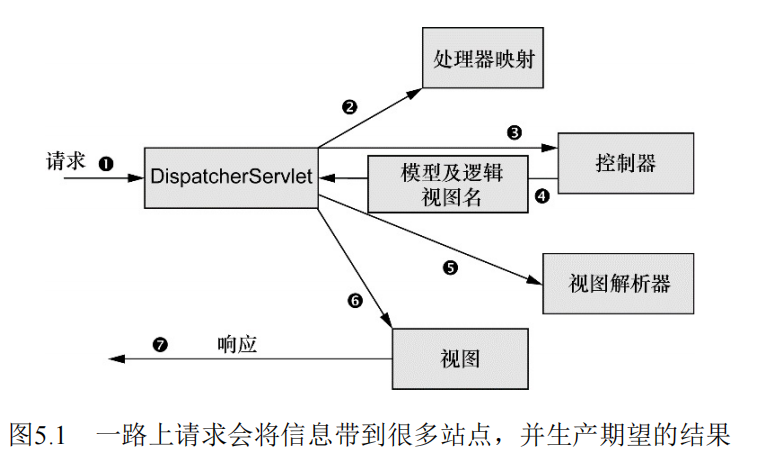

## SpringMVC 

**Spring MVC框架**：
> 基于Web的应用程序中，状态管理、工作流以及验证都是需要解决的重要特性。  
> HTTP协议的无状态性决定了这些问题都不那么容易解决。  
> Spring的Web框架就是为了帮你解决这些关注点而设计的。   
> Spring MVC基于模型-视图-控制器（Model-View-Controller，MVC）模式实现 ，    
> 它能够帮你构建像Spring框架那样灵活和松耦合的Web应用程序。  
- 基于Spring：`SpringMVC`是基于Spring的Web框架。  
- 工作流程：Spring将请 求在调度Servlet、处理器映射（handler mapping）、控制器以及视图 解析器（view resolver）之间移动。  

**前端控制器**：  
> 请求旅程的第一站是Spring的DispatcherServlet。  
> 与大多数基于 Java的Web框架一样，Spring MVC所有的请求都会通过一个前端控制 器（front controller）Servlet。   
> 前端控制器是常用的Web应用程序模 式，在这里一个单实例的Servlet将请求委托给应用程序的其他组件来 执行实际的处理。  
> 在Spring MVC中，DispatcherServlet就是前 端控制器。  



**Spring MVC处理请求的流程**： 
1. 前端控制器`DispatcherServlet`：DispatcherServlet的任务是将请求发送给Spring MVC控制器。  
2. 处理器映射:`DispatcherServlet`查询一个或多个处理器映射来确定请求的下一站在哪里。处理器映射会根据请求所携带的URL信息来进行决策。  
3. 控制器组件：控制器是一个用于处理请求的Spring组件。  
4. 模型：控制器在完成逻辑处理后，通常会产生一些信息，这些信息需要返回 给用户并在浏览器上显示。这些信息被称为模型（model）。 
5. 逻辑视图：控制器所做的最后一件事就是将模型数据打包，并且标示出用于渲染输出的视图名。它接下来会将请求连同模型和视图名发送回`DispatcherServlet` 。  
6. 视图解析器：`DispatcherServlet`将会使用视图解析器（view resolver） 来将逻辑视图名匹配为一个特定的视图实现，它可能是也可能不是 JSP。  
7. 视图：

### 配置SpringMVC  

#### 配置`DispatcherServlet`
> `DispatcherServlet`是Spring MVC的核心。在这里请求会第一次 接触到框架，它要负责将请求路由到其他的组件之中。  
> 按照传统的方式，像DispatcherServlet这样的Servlet会配置在 web.xml文件中，这个文件会放到应用的WAR包里面。 
> 借助于Servlet 3规范和 Spring 3.1的功能增强，这种方式已经不是唯一的方案了。  
- `web.xml`中配置：按照传统的方式，像`DispatcherServlet`这样的`Servlet`会配置在 web.xml文件中，这个文件会放到应用的WAR包里面。  
- `Java`配置：会使用`Java`将`DispatcherServlet`配置在`Servlet`容器中，而不会再使用web.xml文件。  

**配置示例**：  
```java
package pers.mortal.learn.springmvc;
import org.springframework.web.servlet.support.AbstractAnnotationConfigDispatcherServletInitializer;
public class SpitterWebAppInitializer
    extends AbstractAnnotationConfigDispatcherServletInitializer {

    @Override
    protected String[] getServletMappings() {
        return new String[]{"/"};       //将DispatcherServlet映射到"/"
    }

    @Override
    protected Class<?>[] getRootConfigClasses() {//返回的带 有@Configuration注解的类将会用来配置ContextLoaderListener创建的应用上下文中的bean

        return new Class<?>[]{RootConfig.class};
    }

    @Override
    protected Class<?>[] getServletConfigClasses() {//带有@Configuration注解的类将会用来定义DispatcherServlet应用上下文中的bean。
        return new Class<?>[]{WebConfig.class};
    }
}
@Configuration
@ComponentScan(basePackageClasses = {RootConfig.class},
        excludeFilters = {
            @ComponentScan.Filter(type = FilterType.ANNOTATION, value= EnableWebMvc.class)
        })
public class RootConfig {}
@Configuration
@EnableWebMvc       //指示这个时配置SpringMVC Bean
@ComponentScan(basePackageClasses = {WebConfig.class})
public class WebConfig extends WebMvcConfigurerAdapter {
    //视图解析器
    @Bean
    public ViewResolver viewResolver(){
        InternalResourceViewResolver resolver =
                new InternalResourceViewResolver();

        resolver.setPrefix("/WEB-INF/views/");
        resolver.setSuffix(".jsp");
        resolver.setExposeContextBeansAsAttributes(true);

        return resolver;
    }
    //静态资源配置，由容器存取，而不是经过DispatcherServlet。  
    @Override
    public void configureDefaultServletHandling(DefaultServletHandlerConfigurer configurer){
        configurer.enable();
    }
}
```

**配置API**:      
```java
package javax.servlet;
public interface ServletContainerInitializer{
    // 在Servlet3.0中，容器会在类路径查找此接口的类，若发现，则用来配置Servlet容器。  
}
```
```java
package org.springframework.web.servlet.support;
import javax.servlet.ServletContainerInitializer;
public class  SpringServletContainerInitializer implements ServletContainerInitializer{
    //Spring提供了javax.servlet.ServletContainerInitializer接口的实现。  
    //这个实现反过来查找实现`WebApplicationInitializer的类并将配置任务交给它们来完成
}
```
```java
package org.springframework.web.servlet.support;
public interface WebApplicationInitializer{}
```
```java
public abstract class AbstractAnnotationConfigDispatcherServletInitializer implements WebApplicationInitializer{
    //Spring3.2 引入了这个实现，它会同时创建DispatcherServlet和ContextLoaderListener。 
    //因此实现其子列，部署到Servlet3.0时，容器会自动发现它，并用来配置Servlet上下文。  

    //将一个或多个路径映 射到DispatcherServlet上。  
    protected String[] getServletMappings();

    //返回的带 有@Configuration注解的类将会用来配置ContextLoaderListener创建的应用上下文中的bean
    protected Class<?>[] getRootConfigClasses();   

    //带有@Configuration注解的类将会用来定义DispatcherServlet应用上下文中的bean。                                               
    protected Class<?>[] getServletConfigClasses() ;
}
```

#### 启用Spring MVC 

**XML启用Spring MVC**：
```xml
<web-app>
    <!--启用Spring MVC有多种方法，可以XML使用此元素，启动注解驱动的Spring MVC-->
    <mvc:annatation-driven/>
</web-app>
```

**注解配置与启用Spring MVC**: 
```java
@Configuration
@EnableWebMvc       //指示这个时配置SpringMVC Bean
@ComponentScan(basePackageClasses = {WebConfig.class})
public class WebConfig extends WebMvcConfigurerAdapter {//继承`WebMvcConfigurerAdapter`，便于配置Spring MVC。  
    //视图解析器
    //没有配置视图解析器，则Spring默认使用`BeanNameViewResolver`,会查找ID与视图名称匹配的bean，且bean要是先View接口。 
    @Bean
    public ViewResolver viewResolver(){
        InternalResourceViewResolver resolver =
                new InternalResourceViewResolver();

        resolver.setPrefix("/WEB-INF/views/");
        resolver.setSuffix(".jsp");
        resolver.setExposeContextBeansAsAttributes(true);

        return resolver;
    }
    //配置静态资源的处理，要求DispatcherServlet将对静态资源的请求转发到Servlet容器中默认的Servlet上，而不是使用`DispatcherServlet`本身来处理。 
    @Override
    public void configureDefaultServletHandling(DefaultServletHandlerConfigurer configurer){
        configurer.enable();
    }
}
```

### 控制器  

**注解API**:  
- `@RequestMapping`注解： 在Spring MVC中，**控制器只是方法上添加了`@RequestMapping`注解的类**，这个注解声明了它们所要处理的请求。    
- `@Controller`注解：实际上是一个被`@Component`注解的注解，改名是为了表意清晰。  
```java
public @interface RequestMapping{
    Spring[] value();   //指定方法错处理的请求路径。  
    String[] method();  //细化所处理的HTTP方法。
}

@Component
public @interface Controller{}
```

**简单控制器示例**：  
```java
@Controller
public class ExampleController{
    
    @RequestMapping(value="/", method = RequestMethod.GET)
    public String doMethod(){
        //返回逻辑视图名
        return "view_name";
    }
}
```

**控制器测试**：  
> 从Spring3.2开始，可以按照控制器的方式来测试SpringMVC中的控制器，  
> 而不仅仅时作为POJO进行测试。  
```java
public class HomeControllerTest {
    @Test
    public void testHomePage() throws Exception{
        //Mock SpringMVC 与 控制器
        HomeController controller = new HomeController();
        MockMvc mockMvc = MockMvcBuilders.standaloneSetup(controller).build();
        //像控制器发送请求，并测试结果。
        mockMvc.perform(MockMvcRequestBuilders.get("/"))
                .andExpect(MockMvcResultMatchers.view().name("home"));
    }
}
```

**类级别的请求处理**：  
> 可以通过拆分`@RequestMapping`,并将其路径映射部分放到类级别上。  
```java
@Controller
@RequestMapping({"/", "/homepage"})//这个注解内容会应用到控制器的所有处理器方法上。 
public class HomeController{
    @RequestMapping(method = RequestMethod.GET)//处理器方法上的@RequestMapping注解会对类级别上的`@RequestMapping`的声明进行补充。  
    public String home(){}
}
```

**传递模型数据到视图**：  
> 模型数据会作为请求属性放到请求中。  
> 因此在视图中可以通过请求属性来获取模型数据。  
```java
@Controller
@RequestMapping("/controller")
public class ExampleController{
    //法一，处理接受一个Model类型参数，
    @RequestMapping(method = RequestMethod.GET)
    public String doMethod(Model model){
        List<Employee> value ;
        //添加数据到模型上，Model实际是个Map，
        // 若不指定key，那么key会根据至的对象类型推断确定，如List<Employee>值推断key为employeeList
        model.addAttrbute("key", value); 
        return "view_login_name";//最后返回视图的逻辑名。 
    }
    //法二，使用Map代替Model，可以使用非Spring类型的key。 
    @RequestMapping(method = RequestMethod.GET)
    public String doMethod(Map model){
        Integer key;
        List<Employee> value ;
        model.put(key, value); 
        return "view_login_name";//最后返回视图的逻辑名。 
    }
    //法三，直接返回数据。  
     @RequestMapping(method = RequestMethod.GET)
    public String doMethod(Map model){
        List<Employee> value;
        return value;//模型的key根据类型推断，逻辑视图名根据请求路径上推断，如此次推断为视图名为controller。  
    }
}
```

### 请求输入 

**请求输入的方式**：  
> Spring MVC允许以多种方式将客户端中的数据传送到控制器的处理器 方法中，包括：   
- 查询参数（Query Parameter）。 
- 路径变量（Path Variable）。  
- 表单参数（Form Parameter）。   

#### 查询参数 

**API**：  
```java
import java.lang.annotation.ElementType;
@Target(ElementType.LOCAL_VARIABLE)
public @interface RequestParam(){//注解在处理器参数上，标注处理器参数与请求参数关联。  
    String value();//通过value属性指明该参数应该传递哪个请求参数的值(自动将String类型解析为对应数据类型)。  
    String defaultValue();//需要String类型值(因为查询参数是String类型)，设置请求参数的默认值。  
}
```

**示例**：  
```java
@Controller
@RequestMapping("/")
public class ExampleController{
    private static final String MAX_LONG_AS_STRING = Long.toString(Long.MAX_VALUE);
    
    @RequestMapping(method = RequestMethod.GET)
    public String doMethod(
        @RequestParam(value = "max", defaultValue = MAX_LONG_AS_STRING) long max,
        @RequestParam(value = "count", defaultValue = "20") int count
    ){
        return "view_login_name";
    }

}
```

#### 路径变量  

> 在理想情况下，要识别的资源（Spittle）应该通过URL路径进 行标示，而不是通过查询参数。  
> 例如：
> 对“/spittles/12345”发起GET请求要优于对“/spittles/show?spittle_id=12345”发起请求。  
> 前者能够识别出要查询的资源，而后者描述的是带有参数的一个操作——本质上是通过 HTTP发起的RPC。  

**`{}`路径占位符**：  
> 为了实现这种路径变量，Spring MVC允许我们在@RequestMapping 路径中添加占位符。  
> 占位符的名称要用大括号（“{”和“}”）括起来。  
> 路径中的其他部分要与所处理的请求完全匹配，但是**占位符部分可以是任意的值**。   

**API**：  
```java
public @interface PathVariable{
    String value();//标注在处理器参数上，与占位符匹配，输入URI中占据占位符的值给参数。  
}
```

**示例**：  
```java
@Controller
public class ExampleController{
    
    @RequestMapping(value="/{resource_id}", method=RequestMethod.GET)
    public String doMethod(
        @PathVariable("resource_id") long resourceId,   
        Model model
    ){
        model.addAttribute("key", value);
        return "view_login_name";
    }   
    
    //参数名碰巧与占位符的 名称相同，因此我们可以去掉@PathVariable中的value属性：  
    //但需要注意的是，如果你想要重命名参数时，必 须要同时修改占位符的名称，使其互相匹配。
    @RequestMapping(value="/{resource_id}", method=RequestMethod.GET)
    public String doMethod(
        @PathVariablelong long resource_id,   
        Model model
    ){
        model.addAttribute("key", value);
        return "view_login_name";
    }  
}
```

### 处理表单  

**使用分为两个方面**：
- 展现表单。  
- 处理用户通过表单提交的数据。  

**表单示例**：  
```jsp
<%@ page sessio="false" %>
<%@ taglib prefix="c" uri="http://java.sun.com/jsp.jstl/core" %>
<!DOCTYPE html>
<html>
    <head>
        <title>Spitter</title>
    <head>
    <body>
        <h1>Registern</h1>
        <form metho="POST">
            First Name: <input type="text" name="firstName" /><br>
            Last Name: <input type="text" name="lastName" /><br>
            Username: <input type="text" name="username" /><br>
            Password: <input type="password" name="password" /><br>
            <input type="submit" value="Register"/>
        </form>
    </body>
</html>
```

**编写表单控制器**：  
> 表单处理时，在处理POST类型的请求时，在请求处理完成后，最好进行一下重定 向，这样浏览器的刷新就不会重复提交表单了。  
> 接受请求参数的处理器参数必须有对应属性的Getter和Setter方法。例如请求参数abc，则需要getAbc和setAbc方法。 
```java
@Controller
@RequestMapping("/spitter")
public class ExampleController{
    @RequestMapping(value = "/register", method=RequestMethod.POST)
    public String processRegistration(Spitter spitter){         //将请求参数填充到参数对象的同名属性中。  
             
        //当InternalResourceViewResolver看到视图格式中 的“redirect:”前缀时，它就知道要将其解析为重定向的规则，而不是视图的名称。  
        //InternalResourceViewResolver还能识 别“forward:”前缀。当它发现视图格式中以“forward:”作为前缀 时，请求将会前往（forward）指定的URL路径，而不再是重定向。  
        return "redirect:/spitter/" + spitter.getUsername();
    }
    
    @RequestMapping(value="/{username}", method=RequestMethod.GET)
    public String showSpitterProfile(
        @PathVariable String username, Model model
    ){
        Spitter spitter = spitterRepository.findByUsername(usernaem);
        model.addAttribute(spitter);
        return "view_login_name";
    }
}
```

#### 校验表单：  
> 如果用户在提交表单时，漏填，错填输入框，那么就会导致请求参数存在空或错误。  
> 有请求参数填充同名属性而得来的处理器参数对象，就会存在部分属性为空或错误。 
> 这可能会导致一些问题。 
> 例如username和password若为空而不处理的话，将出现安全问题，导致无论是谁只要提交一个空表单就能登录应用。  
- **低级的校验方法**：那就是在处理器方法中添加代码来检查值的合法性，如果值不合法的话，就将注册表单重新显示给用户。  
- **高级的校验方法**：从Spring 3.0开 始，在Spring MVC中提供了对Java校验API的支持。 
    - 低配置： 在Spring MVC中 要使用Java校验API的话，并不需要什么额外的配置。 
    - 添加实现： 只要保证在类 路径下包含这个Java API的实现即可，比如Hibernate Validator。   
    - 校验属性： Java校验API定义了多个注解，这些**注解可以放到属性上**，从而限制这些属性的值。  
    - `javax.validation.constraints`包： 所有的注解都位于`javax.validation.constraints`包中。  
    
**配置校验API依赖**：  
```xml
 <!--校验API-->
<!-- https://mvnrepository.com/artifact/javax.validation/validation-api -->
<dependency>
  <groupId>javax.validation</groupId>
  <artifactId>validation-api</artifactId>
  <version>2.0.1.Final</version>
</dependency>
```

**检验API**:  
> 使用了校验API后，在处理器方法中，添加一个Errors参数，如果校验出现错误，那么这些错误可以通过Errors对象进行访问。  
> Errors参数要紧跟在带有`@Valid`注解的参数后面。
> @Valid注解所标注的就是要检验的参 数
```java
package javax.validation.constraints;

public @interface Valid{}//所注解的参数就是要检验的对象。  

public @interface AssertFalse{  //注解元素必须为boolean，且值为false。 
} 
public @interface AssertTrue{   //注解元素必须为boolean，且值为true。
}  
public @interface DecimalMax{   //所注解的元素必须是数字，并且它的值要小于或等于给定的 BigDecimalString值。
}
public @interface DecimalMax{   //所注解的元素必须是数字，并且它的值要大于或等于给定的 BigDecimalString值。
}
public @interface Digits{       //所注解的元素必须是数字，并且它的值必须有指定的位数
}
public @interface Future{       //所注解的元素的值必须是一个将来的日期
}
public @interface max{          //所注解的元素必须是数字，并且它的值要小于或等于给定的值
}
public @interface min{          //所注解的元素必须是数字，并且它的值要大于或等于给定的值
}
public @interface NotNull{      //所注解元素的值必须不能为null
}
public @interface Null{         //所注解元素的值必须为null
}
public @interface Past{         //所注解的元素的值必须是一个已过去的日期
}
public @interface Pattern{      //所注解的元素的值必须匹配给定的正则表达式
}
public @interface Size{         //所注解的元素的值必须是String、集合或数组，并且它的长度要符 合给定的范围。  
}
```

**校验示例**： 
```java
public class Spitter {
    private Long id;

    @NotNull
    @Size(min=5, max=16)
    private String userName;

    @NotNull
    @Size(min=5, max=25)
    private String password;

    @NotNull
    @Size(min=5, max=30)
    private String firstName;

    @NotNull
    @Size(min=2, max=30)
    private String lastName;

    public String getUserName(){
        return this.userName;
    }

    public String getPassword(){
        return this.password;
    }

    public String getFirstName(){
        return this.firstName;
    }

    public String getLastName(){
        return this.lastName;
    }

    public void setUserName(String userName){
        this.userName = userName;
    }

    public void setPassword(String password){
        this.password = password;
    }

    public void setFirstName(String firstName){
        this.firstName = firstName;
    }

    public void setLastName(String lastName){
        this.lastName = lastName;
    }

    @Override
    public boolean equals(Object other){
        return EqualsBuilder.reflectionEquals(this, other, "id", "password");
    }

    @Override
    public int hashCode(){
        return HashCodeBuilder.reflectionHashCode(this, "id", "password");
    }

}
```
```java
@Controller
public class Controller{
  @RequestMapping(value = "/register", method = RequestMethod.POST)
    public String processRegistration(@Valid Spitter spitter, Errors errors){
        if(errors.hasErrors()){
            return "registerForm";
        }

        this.spitterRepository.save(spitter);
        return "redirect:/spitter/" + spitter.getUserName();
    }
}
```


