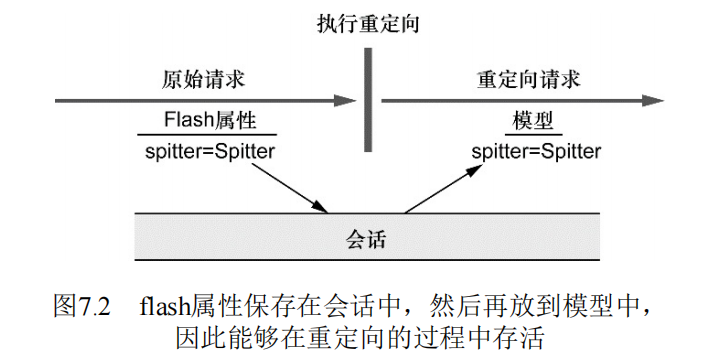

## Spring MVC 高级配置  
> 除了DispatcherServlet以外，我们可能还 需要额外的Servlet和Filter；  
> 我们可能还需要对 DispatcherServlet本身做一些额外的配置；  
> 或者，如果我们需 要将应用部署到Servlet 3.0之前的容器中，那么还需要 将DispatcherServlet配置到传统的web.xml中。  

### Spring MVC配置的替代方案  

#### 自定义DispatcherServlet配置  
**API**:  
```java
public abstract class AbstractAnnotationConfigDispatcherServletInitializer implements WebApplicationInitializer{
    //Spring3.2 引入了这个实现，它会同时创建DispatcherServlet和ContextLoaderListener。 
    //因此实现其子列，部署到Servlet3.0时，容器会自动发现它，并用来配置Servlet上下文。  

    //将一个或多个路径映 射到DispatcherServlet上。  
    protected String[] getServletMappings();

    //返回的带 有@Configuration注解的类将会用来配置ContextLoaderListener创建的应用上下文中的bean
    protected Class<?>[] getRootConfigClasses();   

    //带有@Configuration注解的类将会用来定义DispatcherServlet应用上下文中的bean。                                               
    protected Class<?>[] getServletConfigClasses() ;
    
    //在AbstractAnnotation- ConfigDispatcherServletInitializer 将DispatcherServlet注册到Servlet容器中之后，
    // 就会调 用customizeRegistration()，并将Servlet注册后得到的 Registration.Dynamic传递进来。
    // 通过重 载customizeRegistration()方法，我们可以对 DispatcherServlet进行额外的配置。 
    @Override
    protected void customizeRegistration(ServletRegistration.Dynamic registration);
}
```

**示例**： 
```java
public abstract class AbstractAnnotationConfigDispatcherServletInitializer implements WebApplicationInitializer{
    @Override
    protected void customizeRegistration(ServletRegistration.Dynamic registration){
        //设置Multipart配置
        registration.setMultipartConfig(
                new MultipartConfigElement("/tmp/spitter/uploads"));
        //设置优先级
        registration.setLoadOnStartup(-1);
        //设置初始化参数
        registration.setInitParameter("param", "value");
    }
}
```

#### 添加其他Servlet和Filter

> 基于Java的初始化器（initializer）的一个好处就在于我们可以定义任 意数量的初始化器类。  
> 因此，如果我们想往Web容器中注册其他组件 的话，只需创建一个新的初始化器就可以了。  
> 最简单的方式就是实现 Spring的WebApplicationInitializer接口。  
```java
public class OtherServletInitializer implements WebApplicationInitializer {
    @Override
    public void onStartup(ServletContext context){
        //添加其他Servlet
        ServletRegistration.Dynamic myServlet = context.addServlet("myServlet", OtherServlet.class);
        myServlet.addMapping("/custom/*");
        //添加Filter和Listener
        FilterRegistration.Dynamic filter = context.addFilter("myFilter", OtherFilter.class);
        filter.addMappingForUrlPatterns(EnumSet.of(DispatcherType.REQUEST), false, "/custom/*");
    }
}
```

> 如果你只是注册Filter， 并且该Filter只会映射到DispatcherServlet上的话，  
> 那么 在AbstractAnnotationConfigDispatcherServletInitializer 中还有一种快捷方式。   
>为了注册Filter并将其映射到DispatcherServlet，所需要做的仅 仅是重 载AbstractAnnotationConfigDispatcherServletInitializer的getServlet-Filters()方法。
```java
package pers.mortal.learn.springmvc;

import org.springframework.web.servlet.support.AbstractAnnotationConfigDispatcherServletInitializer;

import javax.servlet.Filter;
import javax.servlet.MultipartConfigElement;
import javax.servlet.ServletRegistration;

public class SpitterWebAppInitializer
    extends AbstractAnnotationConfigDispatcherServletInitializer {

    //注册Filter并映射到DispatcherServlet。
    @Override
    protected Filter[] getServletFilters(){
        return new Filter[]{new LogDispatcherServletInStdoutFilter()};
    }
}
``` 

#### 在Web.xml中声明DispatcherServlet  

**在`web.xml`中搭建Spring MVC，并使用xml配置bean**：  
```xml
<?xml version="1.0" encoding="UTF-8" ?>
<web-app version="2.5"
    xmlns="http://java.sun.com/xml/ns/javaee"
    xmlns:xsi="http://www.w3.org/2001/XMLSchema-instance"
    xsi:schemaLocation="http://www.w3.org/2001/XMLSchema-instance 
        http://java.sun.com/xml/ns/javaee/web-app_2_5.xsd">
    
    <!--设置根上下文配置文件的位置，（即ContextLoaderListener创建的上下文的bean定义）-->
    <context-param>
        <param-name>contextConfigLocation</param-name>
        <param-value>/WEB-INF/spring/root-context.xml</param-value>
    </context-param>
    <!-- 注册DContextLoader-Listener-->
    <listener>
        <listener-class>
            org.springframework.web.context.ContextLoaderListener
        </listener-class>
    </listener>    
    <!-- 注册Dispatcher-Servlet -->
    <!-- DispatcherServlet会根据Servlet的名字找到一个文件，并基于该 文件加载应用上下文。-->
    <!-- Servlet的名字 是appServlet，因此DispatcherServlet会从“/WEB- INF/appServlet-context.xml”文件中加载其应用上下文。 -->
    
    <servlet>
        <servlet-name>appServlet</servlet-name>
        <servlet-class>org.springframework.web.servlet.DispatcherServlet</servlet-class>
        <load-on-startup>1</load-on-startup>
        <!--可以在Servlet上指定一个contextConfigLocation初始化参数,
        望指定DispatcherServlet配置文件的位置的话-->
        <init-param>
            <param-name>contextConfigLocation</param-name>
            <param-value>/WEB-INF/appServlet/servlet-context.xml</param-value>
        </init-param>
    </servlet>
    <servlet-mapping>
        <servlet-name>appServlet</servlet-name>
        <url-pattern>/</url-pattern>
    </servlet-mapping>
</web-app>
```

**在`web.xml`中搭建Spring MVC，并使用Java配置bean**:   
> 要在Spring MVC中使用基于Java的配置，我们需要告诉 DispatcherServlet和ContextLoaderListener使 用AnnotationConfigWebApplicationContext，  
> 这是一 个WebApplicationContext的实现类，它会加载Java配置类，而 不是使用XML。   
>要实现这种配置，我们可以设置contextClass上下文参 数以及DispatcherServlet的初始化参数。  
>如下的程序清单展现 了一个新的web.xml，在这个文件中，它所搭建的Spring MVC使用基 于Java的Spring   
```xml
<?xml version="1.0" encoding="UTF-8" ?>
<web-app version="2.5"
    xmlns="http://java.sun.com/xml/ns/javaee"
    xmlns:xsi="http://www.w3.org/2001/XMLSchema-instance"
    xsi:schemaLocation="http://www.w3.org/2001/XMLSchema-instance 
        http://java.sun.com/xml/ns/javaee/web-app_2_5.xsd">
    
    <!--使用Java配置，（即ContextLoaderListener创建的上下文的bean定义）-->
    <context-param>
        <param-name>contextClass</param-name>
        <param-value>org.springframework.web.context.support.AnnotationConfigWebApplicationContext</param-value>
    </context-param>
    <!-- 指定根配置类 -->
    <context-param>
        <param-name>contextConfigLocation</param-name>
        <param-value>mypackage.RootConfig</param-value>
    </context-param>
    <!-- 注册ContextLoader-Listener-->
    <listener>
        <listener-class>
            org.springframework.web.context.ContextLoaderListener
        </listener-class>
    </listener>    
    <!-- 注册Dispatcher-Servlet -->
     <servlet>
        <servlet-name>appServlet</servlet-name>
        <servlet-class>org.springframework.web.servlet.DispatcherServlet</servlet-class>
        <load-on-startup>1</load-on-startup>
        <!--使用Java配置-->
        <init-param>
            <param-name>contextClass</param-name>
            <param-value>org.springframework.web.context.support.AnnotationConfigWebApplicationContext</param-value>
        </init-param>
        <!--指定DispatcherServlet配置类-->
        <init-param>
            <param-name>contextConfigLocation</param-name>
            <param-value>mypackage.webConfigConfig</param-value>
        </init-param>
    </servlet>
    <servlet-mapping>
        <servlet-name>appServlet</servlet-name>
        <url-pattern>/</url-pattern>
    </servlet-mapping>
</web-app>
```

### 处理multipart形式数据  

**处理Multipart形式数据**：  
> multipart格式的数据会将一个表单拆分为多个 部分（part），每个部分对应一个输入域。  
> 在编写控制器方法处理文件上传之前，我们必须要配置一个 multipart解析器，通过它来告诉DispatcherServlet该如何读取 multipart请求。  

**multipart解析器**：  
> DispatcherServlet并没有实现任何解析multipart请求数据的功能。  
> 它将该任务委托给了Spring中**`MultipartResolver`策略接口的实现**，通过这个实现类来解析multipart请求中的内容。  
> 从Spring 3.1开 始，Spring内置了两个MultipartResolver的实现供我们选择：   
- **`CommonsMultipartResolver`**：使用Jakarta Commons FileUpload解析multipart请求；   
- **`StandardServletMultipartResolver`**：依赖于Servlet 3.0 对multipart请求的支持（始于Spring 3.1）。  
> Spring内置了 CommonsMultipartResolver，可以作 为StandardServletMultipartResolver的替代方案。  
> 可以在非Servlet3.0的容器中代替StandardServletMultipartResolver。  

**`Part`参数不需要`MultipartResolver`**：  
> 如果在编写控制器方法的时候，通过Part参数的形式接受文件上传，那么就没有必要配置MultipartResolver了。  
> 只 有使用MultipartFile的时候，我们才需要 MultipartResolver。  


#### 配置`MultipartResolver`   

**配置`StandardServletMultipartResovler`**:  
1. 获取`StandartServletMultipartResolver`Bean。  
2. 在`Servlet`中配置Multipart细节(使用`MultipartConfigElement`)。  
> 。具体来讲，我们必须要在web.xml或Servlet初始化类中，将 multipart的具体细节作为DispatcherServlet配置的一部分。  

**配置`MultipartResovler`示例**： 
```java
package pers.mortal.learn.springmvc.multipart;

import org.springframework.context.annotation.*;
import org.springframework.core.io.FileSystemResource;
import org.springframework.core.type.AnnotatedTypeMetadata;
import org.springframework.web.multipart.commons.CommonsMultipartResolver;
import org.springframework.web.multipart.support.StandardServletMultipartResolver;

import java.io.IOException;

@Configuration
public class ExampleMultipartConfig {
    public static int select = 1;
    public static String path = "D:/tmp/part";
            ;
    @Bean
    @Conditional(StandardServletMultipartResolverCondition.class)
    public StandardServletMultipartResolver standardServletMultipartResolver(){
        StandardServletMultipartResolver multipartResolver = new StandardServletMultipartResolver();
        path = "D:/tmp/standard";
        return multipartResolver;
    }

    @Bean
    @Conditional(CommonsMultipartResolverCondition.class)
    public CommonsMultipartResolver commonsMultipartResolver() throws IOException {
        CommonsMultipartResolver multipartResolver = new CommonsMultipartResolver();
        multipartResolver.setUploadTempDir(new FileSystemResource("D:/tmp/commons"));
        multipartResolver.setMaxUploadSize(1024 * 1024 * 10);
        multipartResolver.setMaxInMemorySize(1024 * 1024 );
        path = "D:/tmp/commons";
        return multipartResolver;
    }
}

class StandardServletMultipartResolverCondition implements Condition{

    @Override
    public boolean matches(ConditionContext conditionContext, AnnotatedTypeMetadata annotatedTypeMetadata) {
        if(ExampleMultipartConfig.select == 1){
            return true;
        }
        return false;
    }
}
class CommonsMultipartResolverCondition implements Condition{

    @Override
    public boolean matches(ConditionContext conditionContext, AnnotatedTypeMetadata annotatedTypeMetadata) {
        if(ExampleMultipartConfig.select == 2){
            return true;
        }
        return false;
    }
}
```

#### 配置`MultipartConfigElement`  
> 包含了Multipart的配置细节。  
> 构造器所能接受的参数如下： 
- 文件目录：上传文件将会写入该目录中。  
- 上传文件的最大容量（以字节为单位）： 默认是没有限制的。 
- 整个multipart请求的最大容量（以字节为单位）： 默认是没有限制的，不会关心有多 少个part以及每个part的大小。  
- 文件大小阈值：在上传的过程中，如果文件大小达到了一个指定最大容量（以字 节为单位），将会写入到临时文件路径中。默认值为0，也就是所有上传的文件都会写入到磁盘上。    

**在`WeApplicationInitializer`子类中配置**：  
> 若Servlet初始化类继承了WebApplicationInitializer。  
```java
//若初始化类继承了WebApplicationInitializer
public class OtherServletInitializer implements WebApplicationInitializer {
    @Override
    public void onStartup(ServletContext context){
        DispatcherServlet ds = new DispatcherServlet();
        ServletRegistration.Dynamic servlet = context.addServlet("appServlet", ds);
        servlet.addMapping("/");
        registration.setMultipartConfig(
        new MultipartConfigElement("tmp/spitter/uploads",
            2097152, 4194304, 0));
    }
}
```

**在`AbstractAnnotationConfigDispatcherServletInitializer`中配置**：  
> 若Servlet初始化类继承了AbstractAnnotationConfigDispatcherServletInitializer。  
```java
public class SpitterWebAppInitializer
    extends AbstractAnnotationConfigDispatcherServletInitializer {
    @Override
    protected void customizeRegistration(ServletRegistration.Dynamic registration){
        //设置Multipart配置
        registration.setMultipartConfig(
                new MultipartConfigElement("D:/tmp", 1024 * 1024, 1024 * 1024 * 10, 1024));
        //设置优先级
        registration.setLoadOnStartup(-1);
        //设置初始化参数
        registration.setInitParameter("param", "value");
    }
}
```

**在xml配置`MultipartConfigElement`**：    
> 么可以使用<servlet>中 的<multipart-config>元素。  
```xml
<web-app>
    <servlet>
        <servlet-name>appServlet</servlet-name>
        <servlet-class>
            org.springframework.web.servlet.DispatcherServlet
        </servlet-class>
        <load-on-startup>1</load-on-startup>
        <multipart-config>
            <location>/tmp/spitter/uploads</location>
            <max-file-size>2097152</max-file-size>
            <max-request-size>419304</max-request-size>
        </multipart-config>
    </servlet>
    
</web-app>
```

#### 处理Multipart请求  
> 现在已经在Spring中（或Servlet容器中）配置好了对mutipart请求的处 理，  
> 那么接下来我们就可以编写控制器方法来接收上传的文件。  
> 要实 现这一点，最常见的方式就是在某个控制器方法参数上添 加@RequestPart注解。   

**`@RequestPart`注解控制器方法参数**：   
> `@RequestPart`注解的`value`属性指明`Multipart`的名字.
```java
package pers.mortal.learn.springmvc.multipart;

import org.springframework.stereotype.Controller;
import org.springframework.web.bind.annotation.RequestMapping;
import org.springframework.web.bind.annotation.RequestMethod;
import org.springframework.web.bind.annotation.RequestPart;

import javax.servlet.http.Part;
import java.io.IOException;

@Controller
@RequestMapping("/multipart")
public class MultipartController {

    @RequestMapping(method = RequestMethod.GET)
    public String getForm(){
        return "multipartForm";
    }

    @RequestMapping(method = RequestMethod.POST)
    public String postForm(@RequestPart("profilePicture") MultipartFile profilePicture) throws IOException {

        profilePicture.transferTo(new File(ExampleMultipartConfig.path + "/" + profilePicture.getOriginalFilename()));
        return "redirect:/multipart";
    }

    @RequestMapping(method = RequestMethod.POST)//Servlet3.0中,可以使用Part对象,使用Part类型做参数则不需要MultipartResovler.  
    public String postForm(@RequestPart("profilePicture") Part profilePicture) throws IOException {

        profilePicture.write(ExampleMultipartConfig.path + "/" + profilePicture.getSubmittedFileName());
        return "redirect:/multipart";
    }

}
```

**接受`MultipartFile`**:  
> 使用上传文件的原始byte比较简单但是功能有限。   
> 因此，Spring还提 供了MultipartFile接口，它为处理multipart数据提供了内容更为 丰富的对象。   
```java
public interface MultipartFile{
    String getName();
    String getOriginalFilename();
    String getContentType();
    boolean isEmpty();
    long getSize();
    byte[] getBytes() throws IOException;
    InputStream getInputStream() throws IOException;
    void transferTo(File dest) throws IOException;
}
```
```java
//示例
@Controller 
public class ExampleMultipartController{
    @RequestMapping(
        value="/register",
        method=RequestMethod.POST
    )
    public String processRegistration(
        @RequestPart("profilePicture") MultipartFile profilePicture,//如果用户提交表单的时候没有选择文件， 那么这个数组会是空（而不是null）
        @Valid Sitter spitter, Errors error
    ){
        profilePicture.transferTo(new File("/data/spitter/" + profilePicture.getOriginalFilename()));//将文件写入文件系统。 
    }
}
```

**以Part形式接受上传的文件**：  
> 如果你需要将应用部署到Servlet 3.0的容器中，那么会 有MultipartFile的一个替代方案。  
> Spring MVC也能接受 javax.servlet.http.Part作为控制器方法的参数。  
```java
//Part接口API
package javax.servlet.http;
public interface Part{
    InputStream getInputStream() throws IOException;
    String getContentType();
    String getName();
    String getSubmittedFileName();
    long getSize();
    void write(String fileName)throws IOException;
    void delete()throws IOException;
    Collection<String> getHeaders(String name);
    Collection<String> getHeaderNames();
}
```
```java
//示例
@Controller 
public class ExampleMultipartController{
    @RequestMapping(
        value="/register",
        method=RequestMethod.POST
    )
    public String processRegistration(
        @RequestPart("profilePicture") Part profilePicture,//如果用户提交表单的时候没有选择文件， 那么这个数组会是空（而不是null）
        @Valid Sitter spitter, Errors error
    ){
        profilePicture.write("/data/spitter/" + profilePicture.getOriginalFilename());//将文件写入文件系统。 
    }
}
```

### 处理异常 

**默认异常转化**:   
> 在默认情况下，Spring会将自身的一些异常自动转换为合适的状态 码。  
> 以下一般会由Spring自身抛出，作为DispatcherServlet 处理过程中或执行校验时出现问题的结果。  
> 例如，如果 DispatcherServlet无法找到适合处理请求的控制器方法，那么 将会抛出NoSuchRequestHandlingMethodException异常，最 终的结果就是产生404状态码的响应（Not Found）。  

|Spring异常|HTTP状态码|  
|:---|:---|
|`BindException`|400 - Bad Request|
|`ConversionNotSupportedException`|500 - Internal Server Error|
|`HttpMediaTypeNotAcceptableException`|406 - Not Acceptable|
|`HttpMediaTypeNotSupportedException`|415 - Unsupported Media Type|
|`HttpMessageNotReadableException`|400 - Bad Request|
|`HttpMessageNotWritableException`|500 - Internal Server Error|
|`HttpRequestMethodNotSupportedException`|405 - Method Not Allowed|
|`MethodArgumentNotValidException`|400 - Bad Request|
|`MissingServletRequestParameterException`|400 - Bad Request|
|`MissingServletRequestPartException`|400 - Bad Request|
|`NoSuchRequestHandlingMethodException`|404 - Not Found|
|`TypeMismatchException`|400 - Bad Request|

#### `@ResponseStatus`自定义异常转化     
> 尽管这些内置的映射是很有用的，但是对于应用所抛出的异常它们就 无能为力了。  
> Spring提供了一种机制，能够通过`@ResponseStatus`注解将异常映射为HTTP状态码。  
> 实际上，如果出现任何没有映射 的异常，响应都会带有500状态码，但是，我们可以通过映射异常对这种默认行为进行变更。   

**示例**:   
```java
package pers.mortal.learn.springmvc.exception;

import org.springframework.http.HttpStatus;
import org.springframework.stereotype.Controller;
import org.springframework.web.bind.annotation.RequestMapping;
import org.springframework.web.bind.annotation.RequestMethod;
import org.springframework.web.bind.annotation.ResponseStatus;

@Controller
@RequestMapping("/exception")
public class ExampleExceptionController {

    @RequestMapping(method = RequestMethod.GET)
    public String throwException(){
        throw  new ExampleSpringMVCException();
    }
}

@ResponseStatus(
        value = HttpStatus.NOT_FOUND
        ,reason = "Spring MVC 异常"
)
class ExampleSpringMVCException extends RuntimeException{
}
```

#### `@ExceptionHandler`编写处理异常的方法  
> 如果我们想在响应中不仅要包括状态码，还要包 含所产生的错误.  
> 此时的话，我们就不能将异常视为 HTTP错误了，而是要按照处理请求的方式来处理异常了.  

**`@ExceptionHandler`注解**: 
> 在一个方法上添加`@ExceptionHandler`时,当控制器内的处理器方法抛出异常的时候，将会委托该方法来处理异常。  
> 它返回的是一个String，这与处理请求的方法是一致的，指定了要渲染的逻辑视图名.  
> 对于@ExceptionHandler注解标注的方法来说，比较有意思的一 点在于它能处理同一个控制器中所有处理器方法所抛出的异常.  

**示例**:  
```java
package pers.mortal.learn.springmvc.exception;

import org.springframework.http.HttpStatus;
import org.springframework.stereotype.Controller;
import org.springframework.web.bind.annotation.ExceptionHandler;
import org.springframework.web.bind.annotation.RequestMapping;
import org.springframework.web.bind.annotation.RequestMethod;
import org.springframework.web.bind.annotation.ResponseStatus;

@Controller
@RequestMapping("/exception")
public class ExampleExceptionController {

    @RequestMapping(method = RequestMethod.GET)
    public String throwException(){
        throw new ExampleSpringMVCException();
    }

    @ExceptionHandler(ExampleSpringMVCException.class)
    public String handleSpringMVCException(){
        return "error";
    }
}

@ResponseStatus(
        value = HttpStatus.NOT_FOUND
        ,reason = "Spring MVC 异常"
)
class ExampleSpringMVCException extends RuntimeException{
}
```
```jsp 
<%@ taglib uri="http://java.sun.com/jsp/jstl/core" prefix="c"%>
<%@ page import="java.util.*"%>
<%@ page session="false" contentType="text/html" pageEncoding="UTF-8"%>
<html>
    <head>
        <title>Exception</title>
    </head>
    <body>
        <h1>error</h1>
        <%
            out.println("列举属性<br>");

            Collection<String> list = Collections.list(request.getParameterNames());
            for(String attribute : list){
                out.println(attribute + " : " + attribute + "<br>");
            }

            out.println("结束列举<br>");
        %>
    </body>
</html>
```

#### `@ControllerAdvice`为控制器添加通知  
> 如 果多个控制器类中都会抛出某个特定的异常，那么你可能会发现要在 所有的控制器方法中重复相同的@ExceptionHandler方法。  
> 或 者，为了避免重复，我们会创建一个基础的控制器类，所有控制器类 要扩展这个类，从而继承通用的@ExceptionHandler方法。  
> Spring 3.2为这类问题引入了一个新的解决方案：控制器通知。  
> 控制器 通知（controller advice）是任意带有@ControllerAdvice注解的 类，这个类会包含一个或多个如下类型的方法： 
- `@ExceptionHandler`注解标注的方法。  
- `@InitBinder`注解标注的方法。  
- `@ModelAttribute`注解标注的方法。   
> 在带有@ControllerAdvice注解的类中，以上所述的这些方法会 运用到整个应用程序所有控制器中带有@RequestMapping注解的方 法上。    
> @ControllerAdvice注解本身已经使用了@Component，因此可以被自动扫描到。  

```java
package pers.mortal.learn.springmvc.exception;

import org.springframework.web.bind.annotation.ControllerAdvice;
import org.springframework.web.bind.annotation.ExceptionHandler;

@ControllerAdvice
public class ExampleControllerAdvice {

    @ExceptionHandler(ExampleSpringMVCException.class)
    public String handleException(){
        return "error";
    }
}
```

### 跨重定向请求传递数据  

**`redirect:`重定向**： 
> 当控制器方法返回的String值 以“redirect:”开头的话，那么这个String不是用来查找视图的， 而是用来指导浏览器进行重定向的路径。  
> Spring为重定向功能还提供了一些其他的辅助功能。  

**模型数据在请求内传递**：  
> 一般来讲，当一个处理器方法完成之后，该方法所指定的模型数据将会复制到请求中，并作为请求中的属性，请求会转发 （forward）到视图上进行渲染。  
> 但是对于重定向来说，模型并不能用来传递数据（因为已经）。  

**跨重定向请求传递数据**：  
> 有方案可以能够从发起重定向的方法传递数据给处理重定向方法中。  
- 使用**URL模板**以路径变量和/或查询参数的形式传递数据。  
- 通过**flash属性**发送数据。  

#### 通过URL模板进行重定向  
> 使用`redirect:`指示重定向时，直接使用String连接不是安全。例如：当构建URL或SQL查询语句的时候，使用String连接是很危险的。
> 除了连接String的方式来构建重定向URL，Spring还提供了使用模板的 方式来定义重定向URL。    

**URL模板规则**：  
> 模型中的属性匹配重定向URL中的占位符，则自动填充到占位符，并对不安全字符进行转义。  
> 除此之外，模型中所有其他的原始类型值都可以添加到URL中作为查 询参数。  
> 即模型中的属性不匹配重定向URL中的任何占位符，则它会自动以查询参数的形式附加到重定向URL上。  

**示例**：  

```java
package pers.mortal.learn.springmvc.redirect;

import org.springframework.stereotype.Controller;
import org.springframework.ui.Model;
import org.springframework.web.bind.annotation.PathVariable;
import org.springframework.web.bind.annotation.RequestMapping;
import org.springframework.web.bind.annotation.RequestMethod;
import org.springframework.web.bind.annotation.RequestParam;

@Controller
@RequestMapping("/redirect")
public class ExampleRedirectController {

    @RequestMapping(value= "/url", method = RequestMethod.GET)
    public String transferByURLPattern(@RequestParam("data") String data,
                                       @RequestParam("id") int id,
                                       Model model){
        // 模型中的属性匹配重定向URL中的占位符，则自动填充到占位符，并对不安全字符进行转义。
        // 除此之外，模型中所有其他的原始类型值都可以添加到URL中作为查 询参数。
        // 即模型中的属性不匹配重定向URL中的任何占位符，则它会自动以查询参数的形式附加到重定向URL上。
        model.addAttribute("data", data);
        model.addAttribute("id", id);
        return "redirect:/redirect/url/{data}";
    }

    @RequestMapping(value="/url/{data}", method=RequestMethod.GET)
    public String redirectUrl(@PathVariable("data") String data,
                              @RequestParam("id") int id,
                              Model model){
        model.addAttribute("data",data);
        model.addAttribute("id", id);
        return "redirectPage";
    }
}

```

**URL模板传递数的限制**：  
> 通过路径变量和查询参数的形式跨重定向传递数据只能用来发送简单的值。如String和 数字的值。   
>在URL中，并没有办法发送更为复杂的值。 

#### 使用`flash`属性  
> Spring提供了将数据发送为flash属性（flash attribute）的功能。 按照定义，flash属性会一直携带这些数据直到下一次请求，然后才 会消失。  

**`Model`子接口`RedirectAttributes`设置`falsh`属性**：    
> Spring提供了通过RedirectAttributes设置flash属性的方法，这 是Spring 3.1引入的Model的一个子接口。  
> RedirectAttributes提 供了Model的所有功能，除此之外，还有几个方法是用来设置flash属 性的。  
> RedirectAttributes提供了一组 addFlashAttribute()方法来添加flash属性。  

**示例**：  
```java
package pers.mortal.learn.springmvc.redirect;

import org.springframework.stereotype.Controller;
import org.springframework.ui.Model;
import org.springframework.web.bind.annotation.PathVariable;
import org.springframework.web.bind.annotation.RequestMapping;
import org.springframework.web.bind.annotation.RequestMethod;
import org.springframework.web.bind.annotation.RequestParam;
import org.springframework.web.servlet.mvc.support.RedirectAttributes;

@Controller
@RequestMapping("/redirect")
public class ExampleRedirectController {

    //使用Flash属性
    @RequestMapping(value="/flash", method= RequestMethod.GET)
    public String transerByFlashAttribute(@RequestParam("data") String data,
                                          @RequestParam("id") int id,
                                          RedirectAttributes model){
        model.addFlashAttribute("data", data);
        model.addAttribute("id", id);

        return "redirect:/redirect/flash/{id}";
    }

    @RequestMapping(value="/flash/{id}", method = RequestMethod.GET)
    public String redirectFlash( @PathVariable("id") int id,
                                Model model){
        model.addAttribute("id", id);
        return "redirectPage";
    }
}

```

**`flash`属性工作原理**：  
> 在重定向执行之前，所有的flash属性都会复制到会话中。  
> 在重定向 后，存在会话中的flash属性会被取出，并从会话转移到模型之中。  




 

