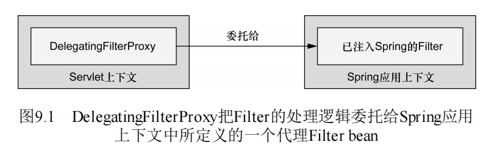

## Spring Security   

### Spring Security 基础  
> Spring Security是为基于Spring的应用程序提供声明式安全保护的安全性框架。  
> Spring Security提供了完整的安全性解决方案，它能够在Web 请求级别和方法调用级别处理身份认证和授权。  

**Spring Security解决安全问题的角度**： 
> Spring Security从两个角度来解决安全性问题。  
- 保护请求URI: 它使用Servlet规范中的Filter保护Web请求并限制URL级别的访问。   
- 保护方法调用： Spring Security还能够使用Spring AOP保护方法调用。 

#### Spring Security 模块  
**Spring Security模块**：  
> 不管你想使用Spring Security保护哪种类型的应用程序，  
> 第一件需要做 的事就是将Spring Security模块添加到应用程序的类路径下。  
>Spring Security 3.2分为11个模块。  
```xml
<project>
    <properties>
        <org.springframework.security.version>5.4.5</org.springframework.security.version>
    </properties>
    <!-- spring security 的11个模块-->
    <dependencies>
        <!-- 支持通过访问孔指列表为域对象提供安全性 -->
        <dependency>
          <groupId>org.springframework.security</groupId>
          <artifactId>spring-security-acl</artifactId>
          <version>${org.springframework.security.version}</version>
        </dependency>
        <!-- 一个很小的模块，当使用Spring Security注解时，会使用基于AspectJ的切面，而不是使用标准的SpringAOP -->
        <dependency>
          <groupId>org.springframework.security</groupId>
          <artifactId>spring-security-aspects</artifactId>
          <version>${org.springframework.security.version}</version>
        </dependency>
        <!-- 提供域Jasig的中心认证服务（Central Authentication Servic, CAS)进行集成的功能 -->
        <dependency>
          <groupId>org.springframework.security</groupId>
          <artifactId>spring-security-cas</artifactId>
          <version>${org.springframework.security.version}</version>
        </dependency>
        <!-- 通过XML和Java配置Spring Security的功能支持 -->
        <dependency>
          <groupId>org.springframework.security</groupId>
          <artifactId>spring-security-config</artifactId>
          <version>${org.springframework.security.version}</version>
        </dependency>
        <!-- 提供Spring Security基本库 -->
        <dependency>
          <groupId>org.springframework.security</groupId>
          <artifactId>spring-security-core</artifactId>
          <version>${org.springframework.security.version}</version>
        </dependency>
        <!-- 提供了加密域密码编码的功能 -->
        <dependency>
          <groupId>org.springframework.security</groupId>
          <artifactId>spring-security-crypto</artifactId>
          <version>${org.springframework.security.version}</version>
        </dependency>
        <!-- 支持居于LDAP进行认证 -->
        <dependency>
          <groupId>org.springframework.security</groupId>
          <artifactId>spring-security-ldap</artifactId>
          <version>${org.springframework.security.version}</version>
        </dependency>
        <!-- 支持使用OpenID进行集中式认证 -->
        <dependency>
          <groupId>org.springframework.security</groupId>
          <artifactId>spring-security-openid</artifactId>
          <version>${org.springframework.security.version}</version>
        </dependency>
        <!-- 提供了对Spring Remoting的支持-->
        <dependency>
          <groupId>org.springframework.security</groupId>
          <artifactId>spring-security-remoting</artifactId>
          <version>${org.springframework.security.version}</version>
        </dependency>
        <!-- Spring Security的JSP标签库 -->
        <dependency>
          <groupId>org.springframework.security</groupId>
          <artifactId>spring-security-taglibs</artifactId>
          <version>${org.springframework.security.version}</version>
        </dependency>
        <!-- 提供了Spring Security基于Filter的Web安全性支持 -->
        <dependency>
          <groupId>org.springframework.security</groupId>
          <artifactId>spring-security-web</artifactId>
          <version>${org.springframework.security.version}</version>
        </dependency>
    </dependencies>
</project>
```

**Spring Security依赖说明**：  
> 应用程序的类路径下至少要包含Core和Configuration这两个模块。   
> Spring Security经常被用于保护Web应用，这显然也是Spittr应用的场 景，所以我们还需要添加Web模块。   
>同时我们还会用到Spring Security 的JSP标签库，所以我们需要将这个模块也添加进来。 

#### 过滤Web请求  

> Spring Security借助一系列Servlet Filter来提供各种安全性功能。    
> 借助Spring Security只需要配置一个Filter即可。 

**`DelegatingFilterProxy`将任务委托给`javax.servlet.Filter`实现的Bean**: 
> DelegatingFilterProxy是一个特殊的Servlet Filter， 
> 它将工作委托给一个javax.servlet.Filter实 现类，  
> 这个实现类作为一个<bean>注册在Spring应用的上下文中 。   

  

**`web.xml`配置**：  
> 最重要的是<filter-name>设置成了 springSecurityFilterChain。  
> 这是因为我们马上就会将Spring Security配置在Web安全性之中，这里会有一个名 为springSecurityFilterChain的Filter bean，  
> DelegatingFilterProxy会将过滤逻辑委托给它。  
```xml
<web-app>
    <filter>
        <filter-name>springSecurityFilterChain</filter-name>
        <filter-name>org.springframework.web.filter.DelegatingFilterProxy</filter-name>
    </filter>
</web-app>
```

**java配置**： 
> 如果你希望借助WebApplicationInitializer以Java的方式来配 置Delegating-FilterProxy的话，那么我们所需要做的就是创 建一个扩展的新类  
> 可以重载 它的appendFilters()或insertFilters()方法来注册自己选择 的Filter，  
> 但是要注册DelegatingFilterProxy的话，我们并不需 要重载任何方法。  
```java
import org.springframework.security.web.context.AbstractSecurityWebApplicationInitializer;  
public class SecurityWebInitializer extends AbstractSecurityWebApplicationInitializer{ 
}
```

**`DelegatingFilterProxy`**: 
> 不管我们通过web.xml还是通过 AbstractSecurityWebApplicationInitializer的子类来配 置DelegatingFilterProxy，  
>它都会拦截发往应用中的请求，并 将请求委托给ID为springSecurityFilterChain bean。  

**`SpringSecurityFilterChaing`**:  
> springSecurityFilterChain本身是另一个特殊的Filter，它也 被称为FilterChainProxy。  
> 它可以链接任意一个或多个其他的 Filter。  

**自动创建Filter提供安全特性**： 
> Spring Security依赖一系列Servlet Filter来提供不同的安全特 性。  
> 但是，你几乎不需要知道这些细节，因为你不需要显式声 明springSecurityFilterChain以及它所链接在一起的其他 Filter。  
>当我们启用Web安全性的时候，会自动创建这些Filter。  

#### 简单的安全配置  
> 在Spring Security的早期版本中（在其还被称为Acegi Security之时）， 为了在Web应用中启用简单的安全功能，我们需要编写上百行的XML 配置。  
> Spring Security 2.0提供了安全性相关的XML配置命名空间，让 情况有了一些好转。  
> Spring 3.2引入了新的Java配置方案，完全不再需要通过XML来配置安 全性功能了。  

**启用Web安全特性**： 
- `@EnableWebSecurity`注解：启用Web安全功能。 
- `@EnableWebMvcSecurity`注解：Spring MVC开始则使用`@EnableWebMvcSecurity`代替`@EanbleWebSecurity`。   
    - 配置了一 个**Spring MVC参数解析解析器**: 
        > 这样的话处理器方法就能够通过带有`@AuthenticationPrincipal`注解的参数获 得认证用户的`principal`（或username）。  
    - 配置了一个bean: 
        > 在使用Spring表单绑定标签库来定义表单时，这个bean会自动添加一个**隐藏的跨站请求伪造**（cross-site request forgery，CSRF）**token输入域**。  
- `WebSecurityConfigurer`接口与`WebSecurityConfigurerAdapter`： 
    > Spring Security必须配置在一个实现了 WebSecurityConfigurer的bean中，或者（简单起见）扩 展WebSecurityConfigurerAdapter。  
- 重载`configure`方法：  
    > 通过重载WebSecurityConfigurerAdapter的三 个configure()方法来配置Web安全性，这个过程中会使用传递进 来的参数设置行为。                                        
                                                  
```java
package pers.mortal.learn.springmvc.security;

import org.springframework.context.annotation.Configuration;
import org.springframework.security.config.annotation.authentication.builders.AuthenticationManagerBuilder;
import org.springframework.security.config.annotation.web.builders.HttpSecurity;
import org.springframework.security.config.annotation.web.builders.WebSecurity;
import org.springframework.security.config.annotation.web.configuration.WebSecurityConfigurerAdapter;
import org.springframework.security.config.annotation.web.servlet.configuration.EnableWebMvcSecurity;

@Configuration
@EnableWebMvcSecurity
public class ExampleSecurityConfiguration extends WebSecurityConfigurerAdapter {
    
    @Override//通过重载，配置Spring Security的Filter 链
    public void configure(WebSecurity webSecurity)throws Exception{
    
    }

    @Override//通过重载，配置如何通过拦截器保护 请求
    public void configure(HttpSecurity httpSecurity)throws Exception{
       httpSecurity
          .authorizeRequests()
              .anyRequest().authenticated()
              .and()
          .formLogin().and()
          .httpBasic();
        //这个简单的默认配置指定了该如何保护HTTP请求，以及客户端认证用户的方案。 
        //但是没有人能成功，因为没有重载configure(AuthenticationManagerBuilder)提供用户储存。  
    }

    @Override//通过重载，配置user-detail服务
    public void configure(AuthenticationManagerBuilder builder){
        
    }
}
```

**Spring Security配置要点**： 
> 为了让Spring Security满足我们应用的需求, 需要：  
> 除了Spring Security的这些功能，我们可能还希望基于安全限制，有选 择性地在Web视图上显示特定的内容。  
- 配置用户储存。  
- 指定哪些请求需要认证，哪些请求不需要认证，以及所需要的权限。  
- 提供自定义的登录页面，替代原来简单的默认登录页面。  

### 选择查询用户详细信息的服务  

#### 基于内存的用户储存认证   
- `inMemoryAuthentication()`方法： 
    > 通过inMemoryAuthentication() 方法，我们可以启用、配置并任意填充基于内存的用户存储。  
-  `withUser()`方法返回的 是`UserDetailsManagerConfigurer.UserDetailsBuilder`。  
    > 这个对象提供了多个进一步配置用户的方法。  

**`UserDetailsManagerConfigurer.UserDetailsBuilder`**:   

|方法|描述|
|:---|:---|
|`accountExpired(boolean)`|定义账号是否已经过期|
|`accountLocked`|定义账号是否已经锁定|          
|`and`|用来连接配置| 
|`authorities(GrantedAuthority...)`|授予某个用户一项或多项权限| 
|`authorities(List<? extends GrantedAuthority)`|授予某个用户一项或多项权限| 
|`authorities(String...)`|授予某个用户一项或多项权限| 
|`credentialsExpired(boolean)`|定义凭证是否过期| 
|`disabled(boolean)`|定义账号是否已被禁用| 
|`password(String)`|定义用户的密码| 
|`roles(String...)`|授予某个用户一项或多项角色| 
                                         
```java
@Configuration 
@EnableWebMvcSecurity 
public class ExampleSecurityConfiguration extends WebSecurityConfigurerAdapter {

    @Override//通过重载，配置user-detail服务
    public void configure(AuthenticationManagerBuilder builder)throws Exception{
        // Spring Security 5.0 中新增了多种加密方式，也改变了密码的格式。
        //故需要指定passwordEncoder加密
        builder.inMemoryAuthentication().passwordEncoder(new BCryptPasswordEncoder())
                .withUser("zhongjingwen").password(new BCryptPasswordEncoder().encode("123456789")).roles("Manager", "Admin")//roles方法自动添加`ROLE_`前缀。
                .and()
                .withUser("zhongdongxiao").password(new BCryptPasswordEncoder().encode("987654321")).roles("Manager");
    }
}

```

#### 基于数据库表的用户储存认证  
```java
@Configuration
@EnableWebMvcSecurity
public class ExampleSecurityConfiguration extends WebSecurityConfigurerAdapter {

    @Override//通过重载，配置user-detail服务
    public void configure(AuthenticationManagerBuilder builder)throws Exception{
        //为 了配置Spring Security使用以JDBC为支撑的用户存储，我们可以使 用jdbcAuthentication()。
        //默认的最少配置要求数据库模式满足以下要求。
        String DEF_USERS_BY_USERNAME_QUERY =
                "SELECT username, password, enabled " +
                        "FROM users " +
                        "where username = ? ";
        String DEF_AUTHORITIES_BY_USERNAME_QUERY =
                "SELECT username, authority " +
                        "FROM authorities " +
                        "WHERE username = ? ";
        String DEF_GROUP_AUTHORITIES_BY_USERNAME_QUERY =
                "SELECT g.id, g.group_name, ga.authority " +
                        "FROM groups g, group_members gm, group_authorities ga " +
                        "WHERE gm.username = ? " +
                        "   AND g.id = ga.group_id " +
                        "   AND g.id = gm.group_id";

        builder.jdbcAuthentication().dataSource(dataSource)
        //将默认的SQL查询替换为自定义的设计时，很重要的一点就是要遵循 查询的基本协议。所有查询都将用户名作为唯一的参数。
        .usersByUsernameQuery(DEF_USERS_BY_USERNAME_QUERY)
        .authoritiesByUsernameQuery(DEF_AUTHORITIES_BY_USERNAME_QUERY)//权限查询会选取零行或多行包 含该用户名及其权限信息的数据。
        .groupAuthoritiesByUsername(DEF_GROUP_AUTHORITIES_BY_USERNAME_QUERY)//群组权限查询会选取零行或多行数据，每行数据中都会包含群组ID、群组名称以及权限。
        .passwordEncoder(new BCryptPasswordEncoder());
        //passwordEncoder()方法可以接受Spring Security中 PasswordEncoder接口的任意实现。
        // Spring Security的加密模块包括 了三个这样的实 现：BCryptPasswordEncoder、NoOpPasswordEncoder和 StandardPasswordEncoder。
        //public interface PasswordEncoder{
        //  String encode(CharSequence rawPassword);
        //  boolean matches(CharSequence rawPassword, String encodedPasword);
    }
}
```

#### 配置自定义的用户服务  
> 假设我们需要认证的用户存储在非关系型数据库中，如Mongo或 Neo4j，  
> 在这种情况下，我们需要提供一个自定义的 UserDetailsService接口实现。  

**`UserDetailsService`接口**：  
> UserDetailsService有意思的地方在于它并不知道用户数据存储 在什么地方。  
> 不知道也不会关心底层所使用的数据存 储。 
```java
import org.springframework.security.core.userdetails.UsernameNotFoundException;public interface UserDetailService{
    UserDetails loadUserByUsername(String username)throws UsernameNotFoundException;
}
``` 

**配置使用`UserDetailsService`接口实现**： 
```java
@Configuration
@EnableWebMvcSecurity
public class ExampleSecurityConfiguration extends WebSecurityConfigurerAdapter {

    @Override//通过重载，配置user-detail服务
    public void configure(AuthenticationManagerBuilder builder)throws Exception{
          builder.userDetailsService(new UserDetailsService() {
              @Override
              public UserDetails loadUserByUsername(String s) throws UsernameNotFoundException {
                  String username = s;
                  String password = s;
                  List<GrantedAuthority> authorities = new ArrayList<>();
                  authorities.add(new SimpleGrantedAuthority("ROLE_MEMBER"));
                  authorities.add(new SimpleGrantedAuthority("ROLE_ADMIN"));
                  authorities.add(new SimpleGrantedAuthority("ROLE_MANAGER"));
                  
                  return new User(username,password,authorities);
              }
          });
    }
}
```

### 拦截请求  

**`configure(HttpSecurity)`**拦截请求**：  
> 在任何应用中，并不是所有的请求都需要同等程度地保护。  
> 对每个请求进行细粒度安全性控制的关键在于重 载configure(HttpSecurity)方法。  
```java
@Configuration
@EnableWebMvcSecurity
public class ExampleSecurityConfiguration extends WebSecurityConfigurerAdapter {
    @Override//通过重载，配置如何通过拦截器保护 请求
    public void configure(HttpSecurity httpSecurity)throws Exception{
//        httpSecurity
//                .authorizeRequests()
//                    .anyRequest().authenticated()
//                .and().httpBasic();
        httpSecurity
                .formLogin()//配置登录页面。
                .and()//返回httpSecurity,用以配置HTTP安全。
                .authorizeRequests()//获取配置所有URL安全细节的对象
                    .antMatchers("/home")//获取匹配的URL的安全配置对象
                        .authenticated()//返回配置所有URL安全细节的对象
                    .antMatchers(HttpMethod.POST, "/multipart").authenticated()
                    .anyRequest().permitAll()
                .and()//返回httpSecurity
                    .csrf().disable()//只能进行**get**请求无法进行**post**请求因为默认开启**csrf**跨域拦截，关闭跨域拦截就ok了
                ;
    }  
}
```

**匹配URL路径**:  
- `antMatchers(String)`方法： 支持Ant风格的统配符，如：`"/spitters/**`。  
- `regexMatchers(String)`方法： 接受正则表达式来定义请求路径。  
- `anyRequest()`方法：匹配任何请求方法。  

**定义保护路径的配置方法**：  
> 用在xxxMatchers()方法后面，针对匹配的URL进行保护。  

|方法|描述|
|:---|:---|
|`access(String)`|如果给定SpEL表达式结算结果为true,就允许访问|
|`anonymous()`|允许匿名访问|
|`authenticated()`|允许认证过的用户访问|
|`fullyAuthenticated()`|如果用户时完整认证的花就允许访问（不是通过Remember-me功能认证）|
|`rememberMe()`|如果用户时通过Remember-me功能认证的，就允许访问|
|`permitall()`|无条件允许访问|
|`denyAll()`|无条件拒绝所有访问|
|`hasAnyAuthority(String...)`|如果用户具备戈丁权限中的某一个的话，就允许访问|
|`hasAuthority(String)`|如果用户具备给定权限的话，就允许访问|
|`hasAnyRole(String...)`|如果用户具备给定角色中的某一个的话，就允许访问|
|`hasRole(String)`|如果用户具备给定角色的话，就允许访问|
|`hasIpAddress(String)`|如果请求来自给定IP地址的话，就允许访问|
|`not()`|对其他访问方法的结果求反|


**配置由详到略**：  
> 很重要 的一点就是将最为具体的请求路径放在前面，而最不具体的路径（如 anyRequest()）放在最后面。  
> 如果不这样做的话，那不具体的路 径配置将会覆盖掉更为具体的路径配置。   

#### 使用Spring表达式进行安全保护  
> 保护路径的配置方法大多数是一维的，能配置的规则不多。  
> 例如：可以使 用hasRole()限制某个特定的角色，但是我们不能在相同的路径上 同时通过hasIpAddress()限制特定的IP地址。  

**`access()`方法**：  
> 借助access()方法，我们也可以将SpEL作为声明访问限制的一种方 式。  
> 从而构建复杂的安全规则。  

**安全表达式的SpEL扩展**：  
|安全表达式|计算结果|
|`authentication`|用户的认证对象|
|`principal`|用户的principal对象|
|`isAnonymous()`|如果当前用户为匿名用户，结果为true|
|`isAuthenticated()`|如果当前用户进行了认证的话，结果为true|
|`isFullyAuthenticated()`|如果当前用户进行了完整认证的话（不是通过 Remember-me功能进行的认证），结果为true|
|`isRememberMe()`|如果当前用户是通过Remember-me自动认证的，结果为 true|
|`permmitAll`|结果始终为true|
|`denyAll`||
|`hasAnyRole(list of roles)`|如果用户被授予了列表中任意的指定角色，结果为true|
|`hasRole(role)`|如果用户被授予了指定的角色，结果为true|
|`hasIpAddress(IP Address)`|如果请求来自指定IP的话，结果为true|

#### 强制通道的安全性  
> 如果我们的应用中有多个链接需要HTTPS，估计 在其中的一两个上忘记添加“s”的概率还是很高的。  
> 另一方面，你可能还会在原本并不需要HTTPS的地方，误用HTTPS。  

**`requiresChannel()`**：  
> 传递到configure()方法中的HttpSecurity对象，除了具 有authorizeRequests()方法以外。  
> 还有一个requiresChannel()方法，借助这个方法能够为各种URL模式声 明所要求的通道。  
- `requiresSecure()`方法：声明匹配的URL需要HTTPS。  
- `requiresInsecure()`方法：声明匹配的URL始终通过HTTP传送。 

```java
@Configuration
@EnableWebMvcSecurity
public class ExampleSecurityConfiguration extends WebSecurityConfigurerAdapter {
    @Override//通过重载，配置Spring Security的Filter 链
    public void configure(WebSecurity webSecurity)throws Exception{

    }

    @Override//通过重载，配置如何通过拦截器保护 请求
    public void configure(HttpSecurity httpSecurity)throws Exception{
//        httpSecurity
//                .authorizeRequests()
//                    .anyRequest().authenticated()
//                .and().httpBasic();
        httpSecurity
                .formLogin()
                .and().authorizeRequests()
                    //...配置路径保护。 
                .and().requiresChannel()
                    .antMatchers("/home")
                        .requiresSecure()
                    ;
    }
}
``` 

#### 防止跨站请求伪造   

**CSRF**:  
> 跨站请求伪造（cross-site request forgery，CSRF）简单来讲，
> 如果一个站点欺骗用户提交请求到其他服务器的话， 就会发生CSRF攻击，这可能会带来消极的后果。 

**默认启用CSRF防护**： 
> 从Spring Security 3.2开始，默认就会启用CSRF防护。  
> 实际上，除非你**采取行为处理**CSRF防护或者将这个**功能禁用**，  
> 否则的话，在应用中 提交表单时，你可能会遇到问题。  

**同步Token实现CSRF方法**： 
> Spring Security通过一个同步token的方式来实现CSRF防护的功能。  
> 它将会拦截状态变化的请求（例如，非GET、HEAD、OPTIONS和 TRACE的请求）并检查CSRF token。  
> 如果请求中不包含CSRF token的 话，或者token不能与服务器端的token相匹配，请求将会失败，并抛 出CsrfException异常。  

**`_csrf`域提交token**：  
> 这意味着在你的应用中，所有的表单必须在一个“_csrf”域中提交 token，而且这个token必须要与服务器端计算并存储的token一致，  
> 这 样的话当表单提交的时候，才能进行匹配。  


**`Thymeleaf`中使用`_csrf`域**：  
> 用Thymeleaf作为页面模板的话，只要<form>标签的 action属性添加了Thymeleaf命名空间前缀，那么就会自动生成一 个“_csrf”隐藏域。  
```
<form method="POST" th:action="@{/spittles}">
</form>
```

**JSP中使用`_csrf`域**：  
```jsp
<input type="hidden" 
    name="${_csrf.parameterName}"
    value="${_csrf.token}"/>
```

**Spring表单标签**：  
> 更好的功能是，如果使用Spring的表单绑定标签的话，  
> `<sf:form>`标 签会自动为我们添加隐藏的CSRF token标签。  

**禁用Spring Security的CSRF**：  
```java
@Configuration
@EnableWebMvcSecurity
public class ExampleSecurityConfiguration extends WebSecurityConfigurerAdapter {

    @Override//通过重载，配置如何通过拦截器保护 请求
    public void configure(HttpSecurity httpSecurity)throws Exception{
        httpSecurity
                .formLogin()
                .and().authorizeRequests()
                    //...
                .and().requiresChannel()
                        //...
                .and().csrf()
                .disable()
                    ;
    }
}
```

### 认证用户  

#### 登录 
**`HttpSecurity`上启动用户认证**： 
    - **`formLogin()`**:  使用默认登录页面。 
        - `loginPage()`: 设置自定义的登录页面。  
    - **`httpBasit()`**: 
        - `realmName(String)`: 指定域。 
    - **`rememberMe()`**: 为应用添加Remember-Me功能。 
        - `tokenValiditySecondes(second)`: 指定过期时间 
        - `key(String)`: 私钥名称，默认为`SpringSecured`。  
        
**Remember-Me功能**：  
> 默认情况下这个功能是通过在cookie中储存一个token完成。   
> 存储在cookie中的token包含用户名、密码、过期时间和一个私钥—— 在写入cookie前都进行了MD5哈希。  
> 默认情况下，私钥的名 为SpringSecured。  

**`remember-me`参数**：  
> 为了实现Remember-Me功能，登录请求必须包含一个名为remember-me的参数。  
> 在登录表单中，增加 一个简单复选框就可以完成这件事情。  
```
<input id="remember_me" name="remember-me" type="checkbox"/>
<label for="remember_me" class="inline">Remember me</label>
```

**登录配置示例**：  
```java
@Configuration
@EnableWebMvcSecurity
public class ExampleSecurityConfiguration extends WebSecurityConfigurerAdapter {
    @Override//通过重载，配置如何通过拦截器保护 请求
    public void configure(HttpSecurity httpSecurity)throws Exception{
        httpSecurity
              .httpBasic()
                  .realmName("realmFiled")
              .and().formLogin()
                  .loginPage("/login.jsp")   //用户未登录时，访问资源跳转的登录页面。
                  .loginProcessingUrl("/login") //登录表单form中action的地址，也就是处理认证请求的路径。
                  .usernameParameter("uname") //登录表单form中用户输入框input的name名，不修改则默认未username。
                  .passwordParameter("pword") //登录表达form中密码输入框input的那么名，不修改默认未password。
                  .defaultSuccessUrl("/index.jsp")    //登录认证成功后默认跳转的路径。
              .and().rememberMe()
                  .tokenValiditySeconds(60)
                  .key("Learn-SpringMVC")
    ;}
}
```

**默认登录页**：  
- `/login`路径：默认登录页的Servlet路径是`/login`。  
- `username`输入域：  
- `password`输入域：  
- `_csrf`隐藏域： 
```html
<!DOCTYPE html>
<html lang="en">
  <head>
    <meta charset="utf-8">
    <meta name="viewport" content="width=device-width, initial-scale=1, shrink-to-fit=no">
    <meta name="description" content="">
    <meta name="author" content="">
    <title>Please sign in</title>
    <link href="https://maxcdn.bootstrapcdn.com/bootstrap/4.0.0-beta/css/bootstrap.min.css" rel="stylesheet" integrity="sha384-/Y6pD6FV/Vv2HJnA6t+vslU6fwYXjCFtcEpHbNJ0lyAFsXTsjBbfaDjzALeQsN6M" crossorigin="anonymous">
    <link href="https://getbootstrap.com/docs/4.0/examples/signin/signin.css" rel="stylesheet" crossorigin="anonymous"/>
  </head>
  <body>
     <div class="container">
      <form class="form-signin" method="post" action="/learn-springMVC/login">
        <h2 class="form-signin-heading">Please sign in</h2>
        <p>
          <label for="username" class="sr-only">Username</label>
          <input type="text" id="username" name="username" class="form-control" placeholder="Username" required autofocus>
        </p>
        <p>
          <label for="password" class="sr-only">Password</label>
          <input type="password" id="password" name="password" class="form-control" placeholder="Password" required>
        </p>
<input name="_csrf" type="hidden" value="c38fa29b-66b1-49ed-938c-4bbc8265594c" />
        <button class="btn btn-lg btn-primary btn-block" type="submit">Sign in</button>
      </form>
</div>
</body></html>
```

#### 登出  
> 在应用中，与登录同等重要的功能就是退出。  
> 如果你启用Remember- me功能的话，更是如此，否则的话，用户将永远登录在这个系统 中。   

**`/logout`请求**： 
> 退出功能是通过Servlet容器中的Filter实现的（默认情况下），这个 Filter会拦截针对“/logout”的请求。  
> 因此，为应用添加退出功能只需添加/logout的链接即可。

**`HttpSecurity`的`logout()`**: 
    - `logoutSuccessUrl(String)`: 设置退出后的重定向的页面。  
    - `logoutUrl(String)`: 重写默认的`LogoutFilter`路径。 

**示例**： 
```java
package pers.mortal.learn.springmvc.security;

import org.springframework.context.annotation.Configuration;
import org.springframework.http.HttpMethod;
import org.springframework.security.config.annotation.authentication.builders.AuthenticationManagerBuilder;
import org.springframework.security.config.annotation.web.builders.HttpSecurity;
import org.springframework.security.config.annotation.web.builders.WebSecurity;
import org.springframework.security.config.annotation.web.configuration.WebSecurityConfigurerAdapter;
import org.springframework.security.config.annotation.web.servlet.configuration.EnableWebMvcSecurity;
import org.springframework.security.crypto.bcrypt.BCryptPasswordEncoder;

@Configuration
@EnableWebMvcSecurity
public class ExampleSecurityConfiguration extends WebSecurityConfigurerAdapter {

    @Override//通过重载，配置如何通过拦截器保护 请求
    public void configure(HttpSecurity httpSecurity)throws Exception{
        httpSecurity
                .and().logout()
                    .logoutUrl("/signout")
                    .logoutSuccessUrl("/")
                    ;
    }
}
```

### 保护视图  
略
~~~~
