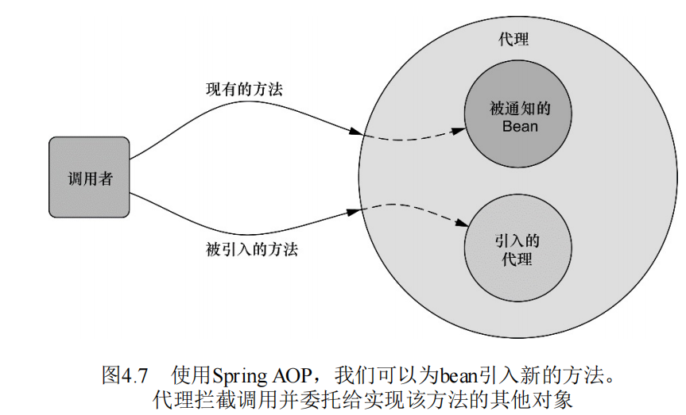
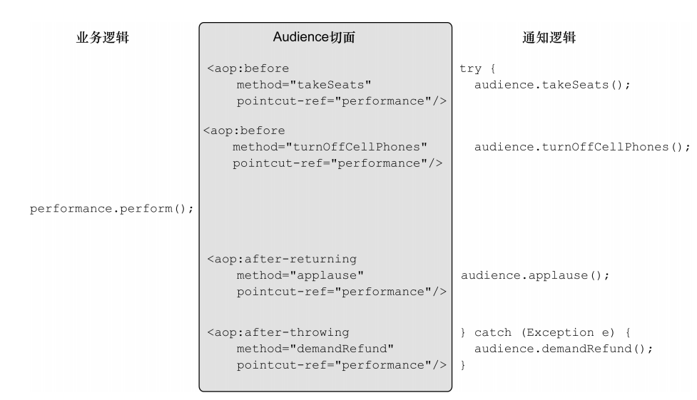

## 切面  

### 切面术语于Spring的切面  
- 横切关注点： 在软件开发中，散布于应用中多处的功能被称为横切关注点（cross- cutting concern）。  
    > 通常来讲，这些横切关注点从概念上是与应用的业 务逻辑相分离的（但是往往会直接嵌入到应用的业务逻辑之中）。 
- 切面编程： 把 这些横切关注点与业务逻辑相分离正是面向切面编程（AOP）所要解决的问题。  
- 切面： 。横切关注点可以被模块化为特殊的类， 这些类被称为切面（aspect）。这样做有两个好处：  
    - 模块化： 首先，现在每个 关注点都集中于一个地方，而不是分散到多处代码中；  
    - 核心简洁： 其次服务模 块更简洁，因为它们只包含主要关注点（或核心功能）的代码，  
    - 而次 要关注点的代码被转移到切面中了。 
    
#### 切面的术语  
- 通知： 切面的工作被称为通知，定义了切面是什么以及何时使用。  
    - 前置通知：在目标方法被调用之前调用通知功能。  
    - 后置通知：在目标方法完成之后调用通知，此时不会关心方法的输出是什么。  
    - 返回通知：在目标方法成功执行之后调用通知。   
    - 异常通知：在目标方法抛出异常后调用通知。  
    - 环绕通知： 通知包裹了被通知的方法，在被通知的方法调用之前和调用之后执行自定义的行为。  
- 连接点： 连接点是在应用执行过程中能够插入切面的一个点。  
- 切点： 切点的定义会匹配通知所要织入的一个或多个连接点。  
- 切面： 切面是通知和切点的结合。通知和切点共同定义了切面的全部内容 ——它是什么，在何时和何处完成其功能。  
- 引入： 引入允许我们向现有的类添加新方法或属性。  
- 织入： 织入是把切面应用到目标对象并创建新的代理对象的过程。切面在指 定的连接点被织入到目标对象中。在目标对象的生命周期里有多个点 可以进行织入：   
    - 编译期：切面在目标类编译时被织入。这种方式需要特殊的编译 器。AspectJ的织入编译器就是以这种方式织入切面的。
    - 加载期：切面在目标类加载到JVM时被织入。这种方式需要特 殊的类加载器（ClassLoader），它可以在目标类被引入应用 之前增强该目标类的字节码。AspectJ 5的加载时织入（load-time weaving，LTW）就支持以这种方式织入切面。  
    - 运行期： 切面在应用运行的某个时刻被织入。一般情况下，在织 入切面时，AOP容器会为目标对象动态地创建一个代理对象。 Spring AOP就是以这种方式织入切面的。  
> 切点的确定： 
> 我们通常使用明确的类和方法名称，或是利用正则表达式定义所匹配的类和方法名称来指定这些切点。  
> 有些AOP框架允许我们创建动态的切 点，可以根据运行时的决策（比如方法的参数值）来决定是否应用通知。  


#### Spring对AOP的支持  
Spring提供了4种类型的AOP支持： 
- 基于代理的经典Spring AOP。  
- 纯POJO切面。  
- `@AspectJ`注解驱动的切面。  
- 注入式AspectJ切面。（适用于Spring各版本）。 
> 前三种都是Spring AOP实现的变体。 
> - 借助Spring的aop命名空间，我们可以将纯POJO转换为切面。  
> - Spring借鉴了AspectJ的切面，以提供注解驱动的AOP。本质上，它依 然是Spring基于代理的AOP，但是编程模型几乎与编写成熟的AspectJ 注解切面完全一致。 
> - 如果你的AOP需求超过了简单的方法调用（如构造器或属性拦截）， 那么你需要考虑使用AspectJ来实现切面。在这种情况下，上文所示 的第四种类型能够帮助你将值注入到AspectJ驱动的切面中。  

#### SpringAOP的关键知识  
- Java编写： Spring所创建的通知都是用标准的Java类编写的。
- 运行时通知： 通过在代理类中包裹切面，Spring在运行期把切面织入到Spring管理的bean中。 
- 只通知方法： Spring只支持方法级别的连接点。 因为Spring基于动态代理，所以Spring只支持方法连接点。  
> 更多说明： 
> - AspectJ与之相反。虽然AspectJ现在支持基于注解的切面，但AspectJ 最初是以Java语言扩展的方式实现的。
> - 代理类封装了目标类，并拦截被通知方法的 调用，再把调用转发给真正的目标bean。当代理拦截到方法调用时， 在调用目标bean方法之前，会执行切面逻辑。 
> - Spring缺少对字段连接点的 支持，无法让我们创建细粒度的通知，例如拦截对象字段的修改。且它不支持构造器连接点，我们就无法在bean创建时应用通知。  
> - 这与 一些其他的AOP框架是不同的，例如AspectJ和JBoss，除了方法切 点，它们还提供了字段和构造器接入点。

### 通过切点选择连接点  

**切点定义**：  
- 切点定义语言： 在Spring AOP中，要使用**AspectJ的切点表达式语言**来定义切点。  
- 定义语言支持： 是Spring仅支持 AspectJ切点指示器（pointcut designator）的**一个子集**。  
- 指示器异常： 在Spring中尝试使用AspectJ其他指示器时，将会抛出 IllegalArgument-Exception异常。  
- 匹配与限制指示器： 意只 有execution指示器是实际执行匹配的，而其他的指示器都是用来 限制匹配的。  

**Spring支持的AspectJ指示器**：  
- `execution()`: 用于匹配是连接点的执行方法。 
- `arg()`:  限制连接点匹配参数为指定类型的执行方法。  
- `@arg()`: 限制连接点匹配参数由指定注解标注的执行方法。 
- `target()`: 限制连接点匹配目标对象为指定类型的类。 
- `@target()`: 限制连接点匹配特定的执行对象，这些对象对应的类要具有指定类型的注解。 
- `within()`: 限制连接点匹配指定的类型。
- `@within()`: 限制连接点匹配指定注解所标注的类型（当使用Spring AOP时，方 法定义在由指定的注解所标注的类里）。  
- `annotation`: 限定匹配带有指定注解的连接点。  
- `this()`: 限制连接点匹配AOP代理的bean引用为指定类型的类。  

**编写切点**： 
```
基本语法： 
<方法执行时触发> <返回任意类型> <方法所属类>         .<方法>   <”..“表示是使用任意参数>
execution(          *        concert.Performace.perform(..))

限制匹配
execution( * concert.Performace.perform(..)
            && within(concert.*))
within限制连接点为concert包下的任意类的方法被调用。  
逻辑操作符：连接指示器。 
逻辑操作符："&&"、"and"、"||"、"or"、"!"、"not"。 建议使用单词形式，符号形式如&在XML中由特殊的意义。  
```


**在切点中选择Bean**：  
- `bean()`指示器： Spring还引入了一个新的bean()指示 器，它允许我们在切点表达式中使用bean的ID来标识bean。
> bean() 使用bean ID或bean名称作为参数来限制切点**只匹配特定的bean**。  
```
//希望在执行Performance的perform()方法时应用通 知，但限定bean的ID为woodstock。
execution(* concert.Performace.perform() 
    and bean('woodstock'))
//使用非操作为除了特定ID以外的其他bean应用通知
execution(* concert.Performace.perform() 
    and not bean('woodstock'))
```

### 使用注解创建切面  

**切面注解**： 
- `@Aspect`:  类注解，将POJO声明为一个切面。  
- `@pointcut`: 方法注解，声明一个可重复使用的切点。注解在在一个空的方法，该方法作用仅仅时给注解依赖。  
- `@Before`: 方法注解，通知方法会在目标方法调用之前执行。  
- `@After`: 方法注解，通知方法会在目标方法返回或抛出异常后调用。  
- `@AfterReturning`: 方法注解，通知方法会在目标方法返回后调用。  
- `@AfterThrowing`: 方法注解，通知方法会在目标方法抛出异常后调用。 
- `@Around`: 方法注解，通知方法会将目标方法封装起来。  
    - `ProceedingJoinPoint`类型的参数： 注解的方法必须接受`ProceedingJoinPoint`作为参数。  
        - `proceed()`方法：执行被通知的方法。如果不调这个方法的话，那么你的通知实际上会阻塞对被通知方法的调用。
- `@DeclareParents`: 域注解，声明引入的性接口。 
    - `value`属性： 指定了哪种类型的bean要引入该接口。标记符后面的加号表示包括所有子类型。  
    - `defaultImpl`属性： 指定了为引入功能提供实现的类。  
    - 标注的静态属性： `@DeclareParents`注解所标注的静态属性指明了要引入了接口。  
> 环绕通知的方法： 
> ProceedingJoinPoint作为参数。这个对象是必须要有的，因为你要在通知中通过它来调用被通知的方法。    
> 通知方法中可以做任何的事情，当要将控制权交给被通知的方法时，它需要调用ProceedingJoinPoint的proceed()方法。   
> 需要注意的是，别忘记调用proceed()方法。如果不调这个方法的话，那么你的通知实际上会阻塞对被通知方法的调用。  
> proceed()的妙用：
> 阻塞方法：有意思的是，你可以不调用proceed()方法，从而阻塞对被通知方 法的访问，  
> 重试逻辑： 与之类似，你也可以在通知中对它进行多次调用。要这样 做的一个场景就是实现重试逻辑，也就是在被通知方法失败后，进行 重复尝试。

**启动自动代理**：  
- `@EnableAspectJAutoProxy`注解： JavaConfig的配置类上使用`@EnableAspectJ-AutoProxy`注解启用自动代理功能。  
- `<aop:aspectj-autoproxy>`元素： XML配置中，使用Spring aop命名空间中的<aop:aspectj-autoproxy>元素启动自动代理功能。  

**处理通知中的参数**： 
- 在切点表达式添加参数即可：与无参的不同点在于切点还声明了要提供给通知方法的参数。  
- 注解依赖的方法也包含相关参数。 

```java
@Aspect
public class TrackCounter{
    
    private Map<Integer, Integer> trackCounts = new HashMap<Integer, Integer>();

    @Pointcut(
        "execution(* package.CompactDisc.playTrack(int)) "
        + " && args(trackNumber)"
    )
    public void trackPlayed(int trackNumber){}

    @Before("trackPlayed(trackNumber)")
    public void countTrack(int trackNumber){
        int currentCount = getPlayCount(trackNumber);
        trackCounts.put(trackNumber, currentount + 1);
    }
}
```

#### 通过注解引入新功能  

**引入新功能**：
> 在Spring中，切面只是实现了它们所包装bean相同接口的 代理。   
> 如果除了实现这些接口，代理也能暴露新接口的话，切面所通知的bean看起来像是实现了新的接口，  
> 即便 底层实现类并没有实现这些接口也无所谓。  

**织入和引入的代理本质**：
> 需要注意的是，当引入接口的方法被调用时，代理会把此调用委 托给实现了新接口的某个其他对象。  
> 实际上，一个bean的实现被拆分 到了多个类中。



**引入**：
1. 创建一个接口：这个接口的方法是要被引入到Bean中的新功能。  
2. 实现一个新切面：为了实现引入的功能，我们要创建一个新的切面。  
3. `@DecalerParents`注解：声明引入的接口实例。  
4. 声明为一个bean：和其他切面一样，需要在Spring应用中将其声明为一个Bean。  
> 之前所创建的切面不同，它并没有提供前置、后置或环绕通知，   
> 而是 通过`@DeclareParents`注解，将Encoreable接口引入 到Performance bean中。  
> Spring就会创建一个代理，然后将调用委托给 被代理的bean或**被引入的实现**。    
```java
package concert;
public interface Encoreable{
    void performEncore();
}

@Aspect
public class EncoreableIntroducer{
    @DeclareParents(value = "concert.Performance+",
    defaultImple=DefaultEncoreable.class)
    public static Encoreable encoreable;

}
```

### 在XML声明切面  
> 面向注解的切 面声明有一个明显的劣势：你必须能够为通知类添加注解。  
> 为了做到 这一点，必须要有源码。   
> 如果你需要声明切面，但是又不能为通知类添加注解的时 候，那么就必须转向XML配置了。   

**Spring的AOP配置元素**：
> 在Spring的**aop命名空间中**，提供了多个元素用来在XML中声明切 面，Spring的AOP配置元素能够以非侵入性的方式声明切面。   
- 通知元素的**`pointcut`**属性：属性定义了通知所应用的切点。  
- `<aop:pointcut>`元素定义命名切点。  可在`<aop:config>`下级与`<aop:aspect>`下级定义`<aop:pointcut>`元素。  
- 通知元素的**`pointcut-ref`**属性：通过`<aop:pointcut>`元素的`id`属性值来引用`<aop:pointcut>`元素定义的切点。 
 
```xml
<beans xmlns="http://www.springframework.org/schema/beans"
       xmlns:xsi="http://www.w3.org/2001/XMLSchema-instance"
       xmlns:aop="http://www.springframework.org/schema/aop"
       xsi:schemaLocation="http://www.springframework.org/schema/aop
       http://www.springframework.org/schema/aop/spring-aop-3.2.xsd
       http://www.springframework.org/schema/beans
      http://www.springframework.org/schema/beans/spring-beans.xsd">

    <aop:aspectj-autoproxy/><!--启用@AspectJ注解驱动的切面-->

    <aop:config><!--顶层的AOP配置元素。大多数<aop:*>元素必须包含在<aop:config>元素内-->
        <!--定义一个切面-->
        <aop:aspect ref="bean_id">
            <!--定义一个切点，ref元素引用了一个POJO bean，该bean提供了在切面中通知所调用的方法。—-->
            <aop:pointcut id = "pointcut_id" expression="execution(* *.*(..))"/>
            <!--定义通知-->
            <aop:before pointcut-ref = "pointcut_id" method = "aop_before"/>
            <aop:after pointcut-ref = "pointcut_id" method = "aop_after"/>
            <aop:after-returning pointcut-ref="pointcut_id" method="aop_after_returning"/>
            <aop:after-throwing pointcut-ref="pointcut_id" method="aop_after_throwing"/>
            <aop:around pointcut-ref="pointcut_id" method="aop_around"/>
            
        </aop:aspect>
        <!--引入-->
        <aop:aspect ref="bean_id2">
            <aop:declare-parents implement-interface="" types-matching="" default-impl=""/>
        </aop:aspect>
        <!--定义AOP通知器-->
        <aop:advisor advice-ref="" />

    </aop:config>
</beans>
```

**为通知传递参数**：
唯一的差别在于切点表达式中**包含了一个参数**，这个参数会传递到通知方法中。  
```xml
<beans>
    <aop:config>
        <aop:aspect ref="trackCounter">
        <aop:pointcut id="trackPlayed" expression=
                "execution(* package.CompactDisc.playTrack(in))
                    and args(trackNumber)"/><!--注意：不用&&表示与逻辑，因为在xml中&有特殊意义-->
        </aop:aspect>
        <aop:before pointcut-ref="trackPlayed" method="countTrack"/>
    </aop:config>
</beans>
```


#### 通过切面引入新功能  

**`<aop:declare-parents`引入接口**:
- `types-matching`属性：匹配**要引入功能的Bean**的类型，后根`+`表示匹配所有子类型。   
- `implement-interface`属性：在匹配的Bean类型上的父类结构**增加的接口的类型**。  
- 表示所引入接口的实现：有两种方法
    - `default-impl`属性：用default-impl属性用全限定类名来显式指定Encoreable的实现。  
    - `delegate-ref`属性： delegate-ref属性引用了一个Spring bean作为引入的委托。这需要 在Spring上下文中存在所引用ID的bean。  
    > 使用default-impl来直接标识委托和间接使用delegate-ref的 区别在于后者是Spring bean，它本身可以被注入、通知或使用其他的 Spring配置。  
```xml
<aop:aspect>
    <aop:declare-parents
        types-matching = "package.Performance+"
        implement-interface = "package.Encoreable"
        default-impl ="package.DEfaultEncoreable"/>
</aop:aspect>
```

### 注入AspectJ切面  

**独立的`AspectJ`切面**： 
> 对于大部分功能来讲，AspectJ切面与Spring是相互独立的。  
> 虽然它们 可以织入到任意的Java应用中，这也包括了Spring应用，但是在应用 AspectJ切面时几乎不会涉及到Spring。   

**应用`AspectJ`切面**：
> 但是精心设计且有意义的切面很可能依赖其他类来完成它们的工作。   
> 如果在执行通知时，切面依赖于一个或多个类，我们可以在切面内部实例化这些协作的对象。  
> 但更好的方式是，我们可以借助Spring的依 赖注入把bean装配进AspectJ切面中。  

```
package concert;

public aspect CriticAspect{
    public CriticAspect(){}
    
    pointcut performace() : execution(* perform(..));
    
    afterReturning() : performance(){
        System.out.println(criticismEngine.getCriticism());
    }
    
    private CriticismEngine cirticismEngine;

    public void setCriticismEngine(CriticismEngine criticismEngine){
        this.criticismEngine = criticismEngine;
    }
}
```
```xml
<beans>
    <bean class="package.CriticAspect"
        factory-method="aspectOf">
        <property name="criticismEngine" ref="criticismEngine"/>
    </bean>
</beans>
```

**AspectJ切面不需要织入**：
> 在展示如何实现注入之前，我们必须清楚AspectJ切面根本不需要 Spring就可以织入到我们的应用中。  
> 如果想使用Spring的依赖注入为 AspectJ切面注入协作者，那我们就需要在Spring配置中把切面声明为 一个Spring配置中的<bean>。 

**`<bean>`元素的`factory-method`属性**： 
> `<bean>`的声明与我们在Spring中所看到的其他<bean> 配置并没有太多的区别，  
> 但是最大的不同在于使用了`factory- method`属性。  
> 通常情况下，Spring bean由Spring容器初始化，但是 AspectJ切面是由AspectJ在运行期创建的。  
> 等到Spring有机会 为CriticAspect注入CriticismEngine时，CriticAspect已 经被实例化了。

**`AspectJ切面的静态`aspectOf()`方法**：
> 所有的AspectJ切面都提供了一 个**静态的aspectOf()**方法，该方法返回切面的一个单例。   
> 所以为了 获得切面的实例，我们必须使用`factory-method`来调用`asepctOf()`方法而不是调用CriticAspect的构造器方法。  
