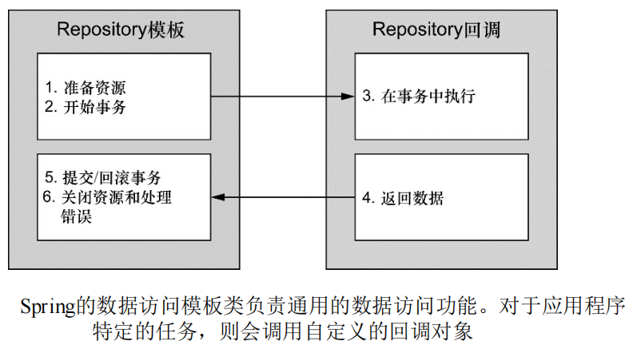

## Spring Data 
- Spring数据访问框架：Spring自带了一组数 据访问框架，集成了多种数据访问技术。    
- 消除样板代码：Spring都能够帮你消除持久化代码中那些单调枯燥的数据访问逻辑。  
> 依赖Spring来处理底层的数据 访问，这样就可以专注于应用程序中数据的管理了。  
> 不管你是直接通过JDBC还 是像Hibernate这样的对象关系映射（object-relational mapping， ORM）框架实现数据持久化，  
> Spring都能够帮你消除持久化代码中那 些单调枯燥的数据访问逻辑。  

### Spring访问哲学  

- 针对接口编程： `Spring`对数据访问的支持也遵循面向对象（OO）原则中的“针对接口编程”。  
- 集中数据访问功能的组件(`DAO`/`Repository`): 最好将数据访问的功能放到一个或多个专注于此项任务的组件中，称为数据访问对象（`data access object，DAO`）或`Repository`。  
- 持久化无关方式设计：数据访问层最好是以持久化技术无关的方式来进行访问的，持久化方式的选择独立于`Repository`，同时只有数据访问相关的方法才通过接口进行暴露。  ，以降低应用程序与数据访问层的耦合，使得设计更灵活
- Spring异常体系：为了将数据访问层与应用程序的其他部分隔离开来，Spring采用的方式之一就是提供统一的异常体系，这个异常体系用在了它支持的所有持久化方案中。  
- 数据访问模板化： 为了利用Spring的数据访问异常，我们必须使用Spring所支持的数据 访问模板。  
> Spring的目标之一就是允许我们在开发应用 程序时，能够遵循面向对象（OO）原则中的“针对接口编程”。Spring 对数据访问的支持也不例外。  
> 
**良好的设计与优势**：  
- 易于测试：不再与特定的数据访问实现绑定在一起，易于实现测试。 
- 持久化无关方式降低耦合：持久化方式的选择独立于`Repository`，同时只有数据访问相关的方法才通过接口进行暴露。  
> 例如创建mock实现来进行测试，无需连接数据库，而且显著提升单元测试效率并排除因数据不一致所造成的错误。   
> 这可以实现灵活的设计，并且切换持久化框架对应用 程序其他部分所带来的影响最小。   
> 如果将数据访问层的实现细节渗透到应用程序的其他部分中，那么整个应用程序将与数据访问层耦合在 一起，从而导致僵化的设计。  

[数据访问层设计](数据访问层设计.png)  

#### Spring数据访问异常体系    

**异常体系需要解决的问题**：   
- `JDBC`的异常体系过于简单：`SQLException`只表示出现了错误，没说明是什么错误。  
- 需要具有描述性且与特定的持久化框架无关的

**`JDBC`异常**： 
```java
public class BatchUpdateException {}
public class DataTruncationException{}
public class SQLException{}
public class SQLWarning{}
```

**`Spring`的数据访问异常**： 
```java
public class DataAccessException extends IoException{}
public class BadSqlGrammarException extends DataAccessException{}
public class CannotAcquireLockException extends DataAccessException{}
public class CannotSerializeTransactionException extends DataAccessException{}
public class CannotGetJdbcConnectionException extends DataAccessException{}
public class CleanupFailureDataAccessException extends DataAccessException{}
public class ConcurrencyFailureException extends DataAccessException{}
public class DataAccessResourceFailureException extends DataAccessException{}
public class DataIntegrityViolationException extends DataAccessException{}
public class DataSourceLookupApiUsageException extends DataAccessException{}
public class DeadlockLoserDataAccessException extends DataAccessException{}
public class DuplicateKeyException extends DataAccessException{}
public class EmptyResultDataAccessException extends DataAccessException{}
public class IncorrectResultSizeDataAccessException extends DataAccessException{}
public class IncorrectUpdateSemanticsDataAccessException extends DataAccessException{}
public class InvalidDataAccessApiUsageException extends DataAccessException{}
public class InvalidDataAccessResourceUsageException extends DataAccessException{}
public class InvalidResultSetAccessException extends DataAccessException{}
public class JdbcUpdateAffectedIncorrectNumberOfRowsException extends DataAccessException{}
public class LbRetrievalFailureException extends DataAccessException{}
public class NonTransientDataAccessResourceException extends DataAccessException{}
public class OptimisticLockingFailureException extends DataAccessException{}
public class PermissionDeniedDataAccessException extends DataAccessException{}
public class PessimisticLockingFailureException extends DataAccessException{}
public class QueryTimeoutException extends DataAccessException{}
public class RecoverableDataAccessException extends DataAccessException{}
public class SQLWarningException extends DataAccessException{}
public class SqlXmlFeatureNotImplementedException extends DataAccessException{}
public class TransientDataAccessException extends DataAccessException{}
public class TypeMismatchDataAccessException extends DataAccessException{}
public class UncategorizedDataAccessException extends DataAccessException{}
public class UncategorizedSQLException extends DataAccessException{}
```

#### 数据访问模板化  

**模板方法模式**： 
> 模板方法定义过程的主要框架。 
> 模板方法将过程中与特定实现相关的部分委托给接口，而这个接口的不同实现定义了过程中的具体行为。  
- 不变的部分：过程本身是固定不变的。
- 变化的部分：在某些特定的步骤上，处理过程会将其工作委派给子类来完成一些特 定实现的细节。   

**Spring数据访问模板化**： 
> Spring将数据访问过程中固定的和可变的部分明确划分为两个不同的类：
- 模板（template）: 模板管理过程中固定的部分。  
- 回调（callback）: 回调处理自定义的数据访问代码。  



**只需关心数据访问逻辑**： 
> Spring的模板类处理数据访问的固定部分——事务控制、 管理资源以及处理异常。  
> 同时，应用程序相关的数据访问——语句、 绑定参数以及整理结果集——在回调的实现中处理。  
> 事实证明，这是 一个优雅的架构，因为你只需关心自己的数据访问逻辑即可。   

**`Spring`数据访问模板**：  
> 针对不同的持久化平台，Spring提供了多个可选的模板。  
> 如果直接使 用JDBC，那你可以选择JdbcTemplate。  
> 如果你希望使用对象关系 映射框架，那HibernateTemplate或JpaTemplate可能会更适合你。  

|模板类(`org.springframeworkd.*)|持久化平台|
|:---|:---|  
|`jca.cci.core.CciTemplate`|JCA CCI 连接 |
|`jdbc.core.JdbcTemplate`| JDBC 连接|
|`jdbc.core.namedparam.NamedParameterJdbcTemplate`| 支持命名参数的JDBC连接|
|`jdbc.core.simple.SimpleJdbcTemplate`| 通过Java5 简化的JDBC连接（Spring3.1已经废弃）|
|`orm.hibernate3.HibernateTemplate`| `Hibernate3.x`以上的`Session`|
|`orm.ibatis.SqlMapClientTemplate`| `IBATIS SqlMap`客户端|
|`orm.jdo.jdoTemplate`| Java数据对象(Java Data Object)实现|
|`orm.jpa.JpaTemplate`| Java持久化API的实体管理期|

### 配置数据源  

#### 使用JNDI数据源  
> 如WebSphere、 JBoss或甚至像Tomcat这样的Web容器中。这些服务器允许你配置通过 JNDI获取数据源。  
> 这种配置的好处在于数据源完全可以在应用程序之 外进行管理，这样应用程序只需在访问数据库的时候查找数据源就可 以了。  
> 另外，在应用服务器中管理的数据源通常以池的方式组织，从 而具备更好的性能，并且还支持系统管理员对其进行热切换。 利用Spring，我们可以像使用Spring bean那样配置JNDI中数据源的  

**`<jee:jndi-lookup>`元素**：  
> 位于jee命名空间下的`<jee:jndi- lookup>`元素可以用于检索JNDI中的任何对象（包括数据源）并将 其作为Spring的bean。  
> 如果应用程序的数据源配置在JNDI中， 我们可以使用`<jee:jndi-lookup>`元素将其装配到Spring中。  
```xml
<beans>
    <!--jndi-name属性用于指定JNDI中资源的名称，那么就会根据指定的名称查找数据源。-->
    <!-- 如果应用程序运行在Java应用服务器中，你需要将resource-ref属性设置为true，-->
    <!-- 这样给定的jndi-name将会自动添 加“java:comp/env/”前缀 -->
    <jee:jndi-lookup id="dataSource"
        jndi-name="/jdbc/ApplicationDatabase"
        resource-ref="true"/>
</beans>
```

**等效的Java配置**：  
```java
@Configuration
public class ExampleDataBaseConfiguration{
    @Bean
    public JndiObjectFactoryBean dataSource(){
        JndiObjectFactoryBean jndiObjectFactoryBean = new JndiObjectFactoryBean();
        jndiObjectFactoryBean.setJndiName("jdbc/ApplicationDataBase");
        jndiObjectFactoryBean.setResourceRef("true");
        jndiObjectFactoryBean.setProxyInterface(javax.sql.DataSource.class);
        return jndiObjectFactoryBean;
    }
}
```

#### 使用数据源连接池  

**添加`DataSource`实现依赖和JDBC驱动程序**：  
> 数据源有多项可用的方案，包括如下开源的实现：   
> Apache Commons DBCP (http://jakarta.apache.org/commons/dbcp)；  
> c3p0 (http://sourceforge.net/projects/c3p0/) ；    
> BoneCP (http://jolbox.com/) 。  
```xml
<dependencies>
    <dependency>
      <groupId>mysql</groupId>
      <artifactId>mysql-connector-java</artifactId>
      <version>8.0.22</version>
    </dependency>
    <dependency>
      <groupId>com.zaxxer</groupId>
      <artifactId>HikariCP</artifactId>
      <version>2.7.1</version>
    </dependency>
</dependencies>
```

**java配置**：  
```java
@Configuration
@ComponentScan(basePackageClasses = {DatabaseConfiguration.class})
public class DatabaseConfiguration {
    public static String JDBC_DRIVER="com.mysql.cj.jdbc.Driver";
    public static String JDBC_URL = "jdbc:mysql://localhost:3306/example_database?serverTimezone=UTC";
    public static String JDBC_USERNAME = "root";
    public static String JDBC_PASSWORD = "root";

    @Bean
    public DataSource dataSource(){
        HikariConfig config = new HikariConfig();
        config.setJdbcUrl(JDBC_URL);
        config.setUsername(JDBC_USERNAME);
        config.setPassword(JDBC_PASSWORD);

        config.addDataSourceProperty("connectionTimeout", "1000");  //超时超时：1秒。
        config.addDataSourceProperty("idleTimeout", "60000");       //空闲超时：60秒。
        config.addDataSourceProperty("maximunPoolSize", "10");      //最大连接数：10。

        DataSource dataSource = new HikariDataSource(config);
        System.out.println("");
        return dataSource;
    }
}
```

#### 基于JDBC驱动的数据源  
> 在Spring中，通过JDBC驱动定义数据源是最简单的配置方式。  
> Spring 提供了三个这样的数据源类均位于 org.springframework.jdbc.datasource包中。  

**基于JDBC驱动的数据源**： 
```java
package org.springframework.jdbc.datasource;

public class DriverManagerDataSource{}  //每个连接请求是都会返回一个新建连接，没有池化管理。  
public class SimpleDriverDataSource{}   //与DriverManagerDataSource类似，直接使用JDBC驱动，来解决在特定环境下的类加载问题，比如OSGi容器。  
public class SingleConnectionDataSource{} //在每个连接请求时都会返回同一个的连接。
```

**Java配置**： 
```java
@Configuration 
public class ExampleDatabaseConfiguration{
    @Bean
    public DataSource dataSource(){
        DriverManagerDataSource dataSource = new DriverManagerDataSource();
        dataSource.setDriverClassName("com.mysql.cj.jdbc.Driver");
        dataSource.setUrl("jdbc:mysql://localhost:3306/example_database?serverTimezone=UTC");
        dataSource.setUsename("root");
        dataSource.setPassword("root");
        return dataSource;
    }
}
```

**`web.xml`配置**：  
```xml
<beans>
    <bean id="dataSource" class="org.springframework.jdbc.datasource.DriverManagerDataSource"
        p:driverClassName="com.mysql.cj.jdbc.Driver"
        p:url="jdbc:mysql://localhost:3306/example_database?serverTimezone=UTC"
        p:username="root"
        p:password="root"/>
</beans>
```

#### 使用嵌入式数据源  
> Spring的jdbc命名空间能简化嵌入式数据库的配置。  
> 除了搭建嵌入式数据库以外，`<jdbc:embedded-database>`元素 还会暴露一个数据源，  
> 我们可以像使用其他的数据源那样来使用它。 

**`web.xml`配置**： 
```xml
<?xml version="1.0" encoding="UTF-8" ?>
<beans xmlns="http://www.springframework.org/schema/beans"
    xmlns:xsi="http://www.w3.org/2001/XMLSchema-instance"
    xmlns:jdbc="http://www.springframework.org/schema/jdbc"
    xmlns:c="http://www.springframework.org/schema/c"
    xsi:schemaLocation="http://www.springframework.org/schema/jdbc 
        http://www.springframework.org/schema/jdbc/spring-jdbc-3.1.xsd
        http://www.springframework.org/schema/beans 
        http://www.springframework.org/schema/beans/spring-beans.xsd">
        
    <jdbc:embedded-database
        id="dataSource" type="H2">
        <!-- 可以不配置也可以配置 多个<jdbc:script>元素来搭建数据库 --> 
        <jdbc:script location="com/habuma/spitter/db/jdbc/schema.sql"/>
        <jdbc:script location="com/habuma/spitter/db/jdbc/test-data.sql"/>
</jdbc:embedded-database>
</beans>
```

**`Java`配置**：  
```java
@Configuration
@ComponentScan
public class ExampleDataBaseSource{
    @Bean
    public DataSource dataSource(){
        return new EmbeddedDatabaseBuilder()
            .setType(EmbeddedDatabaseType.H2)
            .addScript("classpath:schema.sql")
            .addScript("classpath:test-data.sql")
            .build();
    }
}
```

#### 使用`profile`选择数据源

> 在开发，测试，生产环境可以使用不同的数据源，以便进行各个阶段的任务。  
> 可以通过`profile`来设置不同的数据源的`profile`。   
> 从而选择不同的数据源。  

### 在Spring中使用JDBC  
> 如前所述，为了将数据访问层和应用程序其他部分分离，需要Spring数据库异常体系。  
> 为了使用（转化）Spring数据库异常体系，需要使用Spring数据访问模板。  

**Spring的JDBC模板**： 
> Spring 3.1开始，做这个决定变得容易多了。SimpleJdbcTemplate 已经被废弃了，其Java 5的特性被转移到了JdbcTemplate中，   
> 并且 只有在你需要使用命名参数的时候，才需要使 用NamedParameterJdbcTemplate。  
> 这样的话，对于大多数的 JDBC任务来说，JdbcTemplate就是最好的可选方案。
```java
//最基本的Spring JDBC模板，这个模板支持简 单的JDBC数据库访问功能以及基于索引参数的查询。  
package org.springframework.jdbc.core;
public class JdbcTemplate implements JdbcOperations{}
```
```java
//使用该模板类执行查询时 可以将值以命名参数的形式绑定到SQL中，而不是使用简单的索引参数。  
package org.springframeworkd.jdbc.core.namedparam;
public class NamedParameterJdbcTemplate implements NamedParameterJdbcOperations{}
```
```java
//该模板类利用Java 5的一些特性如自 动装箱、泛型以及可变参数列表来简化JDBC模板的使用。
package org.springframework.jdbc.core.simple;
public class SimpleJdbcTemplate{}
```

**获取`JdbcTemplate`和`NamedParameterJdbcTemplate`Bean**：  
> 只需要在构造器上注入`DataSource`依赖即可。  
```java
@Configuration
@ComponentScan(basePackageClasses = {DatabaseConfiguration.class})
public class DatabaseConfiguration {
    public static String JDBC_DRIVER="com.mysql.cj.jdbc.Driver";
    public static String JDBC_URL = "jdbc:mysql://localhost:3306/example_database?serverTimezone=UTC";
    public static String JDBC_USERNAME = "root";
    public static String JDBC_PASSWORD = "root";

    @Bean
    public DataSource dataSource(){
        //获取数据源。 
    }

    @Bean
    public JdbcTemplate jdbcTemplate(DataSource dataSource){
        return new JdbcTemplate(dataSource);
    }

    @Bean
    public NamedParameterJdbcOperations namedParameterJdbcOperations(DataSource dataSource){
        return new NamedParameterJdbcTemplate(dataSource);
    }
}
```

**使用`JdbcTemplate`和`NamedParameterJdbcTemplate`示例**：  
- `@Repository`注解：表明它将会在组件扫描的时候自动创建，实际上等效与`@Component`，改变命名是为了提高阅读性。
- 用模板的接口保持松耦合：应该使用接口来保存实现，这样就可以保证将Repository类通过接口达到与实现保持松耦合。  
- `NamedParameterJdbcTemplate`用`Map`绑定命名参数：使用`NamedParameterJdbcTemplate`时，要使用`Map`来绑定命名参数，才能执行语句。  
```java
@Repository
public class JdbcEntryRepository implements EntryRepository{
    //通过注入JdbcOperations，而不是具体的JdbcTemplate，能够保证JdbcSpitterRepository通 过JdbcOperations接口达到与JdbcTemplate保持松耦合。
    private JdbcOperations jdbcOperations;//。JdbcOperations是一个接口，定义了 JdbcTemplate所实现的操作。
    
    //注入NamedParameterJdbcOperations与注入JdbcOperations`同理。           
    private NamedParameterJdbcOperations namedParameterJdbcOperations;

    @Autowired(required = true)
    public JdbcEntryRepository(JdbcOperations jdbcOperations){
        this.jdbcOperations = jdbcOperations;
    }
    
    @Autowired(required = true)
    public setNamedParameterJdbcOperations(NamedParameterJdbcOperations namedParameterJdbcOperations){
        this.namedParameterJdbcOperations = namedParameterJdbcOperations;
    }

    public void testJdbcTemplate(){
        jdbcOperations.update("INSERT " +
                "INTO Number(column1,column2,column3,column4,column5,column6,column7,column8,column9, column10)" +
                "VALUES (?,?,?,?,?,?,?,?,?,?)",
                1,2,3,4,8,15,15,32,64, 0b1001);//只能按位序添加参数。
        Map<String, Object> map = jdbcOperations.queryForMap("SELECT * FROM Number WHERE id = ?", 1);
        for(Map.Entry<String, Object> entry : map.entrySet()){
            System.out.println(entry.getKey() + " = " + entry.getValue() + " [" + entry.getValue().getClass() + " ]");
        }
    }
    
    public void testNamedParameterJdbcOperations(){
        //使用命名参数
        final String INSERT_NUMBER = "INSERT " +
                "INTO Number(column1,column2,column3,column4,column5,column6,column7,column8,column9, column10)" +
                "VALUES ( :column1, :column2, :column3, :column4, :column5, :column6, :column7, :column8, :column9, :column10)";
        //绑定命名参数
        Map<String, Object> paramMap = new HashMap<>();
        paramMap.put("column1", 1);
        paramMap.put("column2", 2);
        paramMap.put("column3", 3);
        paramMap.put("column4", 4);
        paramMap.put("column5", 8);
        paramMap.put("column6", 15);
        paramMap.put("column7", 15);
        paramMap.put("column8", 32);
        paramMap.put("column9", 64);
        paramMap.put("column10", 0b1111);

        //执行数据
        namedParameterJdbcOperations.update(INSERT_NUMBER, paramMap);
    }
} 
```

**`RowMapper`**：  
> `jdbcOperations`可以将检索的数据组合成一个Java对象。  
> 这需要一个`RowMapper`类型参数，紧跟在SQL查询字符串参数后面。  
> 最后是一个可变列表参数，接受SQL查询参数。 
> `NamedParameterJdbcOperations`也有类似的方法。
```java
//用来从ResultSet中提取数据并构建域对象。  
public interface RowMapper<T>{
    //接受一个ResultSet和一个rowNum参数，rowNum表示ResultSet当前所在行数，要求返回一个由ResultSet当前行各列数填充属性的Java对象。 
    //不可自定改变rs参数的行位置，否则可能导致重复或遗漏构建对象。
    T mapRow(ResultSet rs, int rowNum);
}
```

```java
public class Example{
    private String SELECT_SPITTER_BY_ID = "SELECT * FROM Spitter WHERE id = ? ";
    public Spitter findOne(long id){
        return jdbOperations.queryForObject(SELECT_SPITTER_BY_ID, new SpitterRowMapper(), id);
    }
    
    private static final class SpitterRowMapp implements RowMapper<Spitter>{
        public Spitter mapRow(ResultSet rs, int rowNum){
            return new Spitter(
                rs.getLong("id"),
                rs.getString("username"),
                rs.getString("password"),
                rs.getString("fullName"),
                rs.getString("email"),
                rs.getBoolean("updateByEmail")
            );
        }
    }
}
```