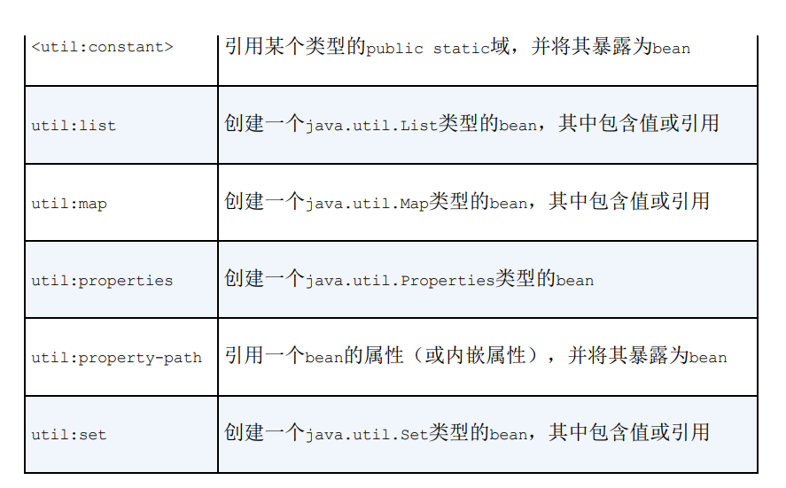

## wiring Bean  

- 在Spring中，对象**无需查找或创建**与其关联的其他对象。  
- 相反，由**Spring容器负责**把相互协作的各个对象**引用赋予各个对象**。  

装配：
- **创建**应用对象之间**协作关系的行为**通常称为装配（wiring）。  
- 这也是**依赖注入的本质**。  

### Spring配置的可选方法  
- 在**XML中**进行显式配置。  
- 在**JAVA中**进行显式配置。  
- 隐式的Bean**发现机制和自动装配**。  

配置方案的建议：  
- 尽可能得使用自动配置机制，**显式配置越少越好**。  
- 显式配置时推荐使用**JavaConfig**。  Java配置比XML配置更强大且类型安全。  
- 只有当你想要使用便利的XML命名空间，并且在JavaConfig中没有同样的实现时，才应该使用XML。  

### 自动化专配Bean  

Spring从两个角度实现自动化装配：  
- **组件扫描（component scannig）**：Sping会自动发现应用上下文中所创建的bean。  
- **自动装配（autowiring）**：Spring自动满足Bean之间的依赖。   

#### 创建可发现的Bean  
1. **创建一个接口**，它将接口所代表的事物与具体实现的**耦合度降低到最小程度**。  
2. 为接口的（接口可以有多个实现）**实现类添加`@Component`注解**，这个注解表明该类会作为组件类。  

#### 组件扫描：   

启动组件扫描：  
- 组件扫描**默认是不启动的**。  
- 在**Java配置**中启动组件扫描：  为配置类添加**`@ComponentScan`**，这个注解**启动组件扫描**。     
- 在**XML配置**中启动组件扫描`spring-context`命名空间的**`<context:component-scan>`**元素启动组件扫描。
- `<context:component-scan>`会有与`@ComponentScan`注解**相对应的属性和子元素**。    
> `<context:component-scan>`元素的**`base-package`属性**设置扫描的基本包，Spring将扫描`base-package`指定的包及其子包。  
> 如果没有其他配置，`@ComponentScan`**默认扫描与配置类相同的包**以及这个包的子包。  

测试组件扫描：  
- 使用`@RunWith`注解的`SpringJunit4ClassRunner`，以便测试开始时候**自动创建Spring的应用上下文**。
- `@ContextConfiguration`注解的`classes`属性告诉它在指定配置类中加载配置。  
- `@Autowired`注解表示注入依赖，给属性添加bean引用。  

为组件扫描的Bean命名：
- Spring应用上下中所有的Bean**都会给定一个ID**。
- `@Component`注解如果没有明确指定ID，**ID默认为类名的第一个字母变为小写**。  
- `@Component`注解用value属性为Bean**设置不同的ID**：**`@Component("mybean")`**。  

`Named`注解： 
- Spring支持**`@Named`**作为`@Compenent`注解的**替代方案**。  
- 可以用`@Named`注解来为bean设置ID：`@Named("yourbean")`。 
>`@Named`是Java依赖注入规范所提供的，它与`@Component`之间有一些细微的差异，大多数请况下可以相互替换。  

设置组件扫描的基本包：
- 没有为`@ComponentScan`注解设置任何属性时，按默认规则，它会**以配置类所在的包**作为基础包。  
- `@ComponentScan`注解的**value属性**中可以指定不同的基础包。  
- 使用`@ComponentScan`注解的**`basePackages`属性**更清晰的表明所设置是基础包，但是这个方法**不是类型安全**。  
- `@ComponentScane`注解的**`basePackageClasses`**属性接受**包中所包含的类或接口**，这些类所在的包将会作为组件扫描的基础包。  
>你可以考虑在包中创建一个用来进行扫描的空标记接口（marker interface）。  
>通过标记接口的方式，你依然能够保持对重构友好的接口引用，但是可以避免引用任何实际的应用程序代码。  
```
@ComponentScan("otherBasePackage")
@ComponentScan(basePackages="package1")             //设置一个基础包。
@ComponentScan(basePackages={package1, package2})   //设置为扫描包的一个数组
@ComponentScane(basePackageClasses=MyClass.class)
@ComponentScane(basePackageClasses={MyClass.class, YourClass.class})
```

#### 自动装配  

自动装配：  
- 简单来说，就是让Spring自动满足Bean依赖的一种方法。 
- 在满足依赖的过程中，会在Spring应用上下文种**寻找匹配某个Bean需求的其他Bean**。  
- Spring的**`AutoWired`**注解声明自动装配。  

`@AutoWired`注解：  
- 在**构造器上添加**`AutoWired`注解，Spring创建这个Bean的时候，会通过这个构造器来进行**实例化并且传入可设置参数类型的Bean**。  
- 在**属性的Setter方法上添加**`AutoWired`注解， 在Spring**初始化bean后**，它会**尽可能**得去满足bean的依赖。  
- **依赖**是通过带有`@Autowired`注解的方法**进行声明**的。
- `@Autowired`注解可以用在类的**任何方法上**，不管是构造器、Setter方法还是其他的方法，Spring都会尝试**满足方法参数上所声明的依赖**。 

自动装配异常：  
- 如果**没有匹配**的Bean，那么在应用上下文创建的时候， Spring**会抛出一个异常**。  
- `@AutoWired`注解的**`required`**属性设置为**`false`**，可以避免没有匹配导致的异常。  
- **多个bean都能满足**依赖关系的话，Spring将会**抛出一个异常**，表明没有明确指定要选择哪个bean进行自动装配。  
>将required属性设置为false时，Spring会尝试执行自动装配，  
>但是如果没有匹配的bean的话，Spring将会让这个bean处于未装配的状态。  
>但是，把required属性设置为false时，你需要谨慎对待。  
>如果在你的代码中没有进行null检查的话，这个处于未装配状态的属性有可能会出现NullPointerException。  

`@Inject`注解： 
- ·@Autowired`是Spring**特有的注解**。  
- 如果你不愿意在代码中到处使用Spring的特定注解来完成自动装配任务的话，那么你可以考虑将其**替换为`@Inject`。  

### 通过Java代码装配Bean  

声明简单的Baen： 
- 在**方法上添加`@Bean`注解**，它会告诉Sring这个方法将会**返回一个对象**，该对象**需要注册为**Spring应用上下文中的**Bean**。  
- 默认请况下：Bean的**ID**与带注解的**方法的名字一样**。  
- 可以用`@Bean`的`name`属性指定一个不同名字：`@Bean("name=newName")`。  

借助JavaConfig实现注入：  
- 装配Bean的最简单方式就是**引用创建bean的方法**。  
- 最佳方式是Bean注解的方法**带有依赖类型的参数**，Spring会自动装配一个参数类型的Bean到配置方法中。  
- Spring中的Bean都是**单例模式**，注解了Bean的方法的调用都**被Spring拦截**，并确保返回的是Spring创建的Bean。  
> 最佳方式注入不会要求参数类型的依赖声明到同一个配置类，甚至没有要求必须使用Java配置。  
> 可以将配置分散到多个配置类、XML文件以及自动扫描和装配bean之中，只要功能完整健全即可。
> Spring都会将其传入到配置方法中。所以是最佳方式。  

### 通过XML配置bean  
- XML配置中，需要创建一个**XML文件**，并且要以**`<beans>`元素为根**。  
- 装配bean的最基本的XML元素包含在**`spring-beans`模式**之中，它被**定义为根命名空间**。
- `<beans>`是该模式中的一个元素，它是**所有Spring配置**文件的根元素。  

声明一个简单的Bean： 
- **`<bean>`**元素用来声明一个Bean，Spring将会自动调用构造器来创建bean。  
- **`class`**属性来指定**创建Bean的类**。  
- **`id`**属性设置该Bean的标识符。  
- 没有明确给出ID的时候，Bean的ID以类的**全限定名**命令，并在后面**添加`#<序号>`**，序号从0开始，**用以区分相同类型的bean**。

#### 借助构造器注入
- 有两种配置方案来实现构造器注入。
- **`<constructor-arg>`**元素。  
- Spring的**c命名空间**,要使用它的话，必须要在XML的顶部声明其模式c。  

`<constructor-arg>`元素：
- 作为`<bean>`的子元素，声明构造器参数要引用的对象。  
- **`ref`**属性引用已声明的Bean的ID，Spring会将依赖Bean注入通过构造器参数注入。  
- **`value`**属性用字面量值来装配Bean，将字面量值注入到Bean中。  
- **`<null/>`**设置构造器参数为null。
- 对于集合的注入，可以用**`<list>、<set>`子元素**，它们使用**`<ref>`子元素引用bean,`<value>`子元素配置字面量值**。  

c命令空间：
- 作为<Bean>的属性。
- 格式为**`c:<参数名>-ref`**，或**`c:_<参数位序>-ref`**。  
- **`-ref`**表示引用Bean，**去掉`-ref`**表示配置字面量值。  
- 构造器**只有一个参数**的时候可以**省略参数位序**。  
- 使用参数名来指示构造器参数可能会在去除调试标志后遇到错误，而使用位序则不会出现这个请况。  

#### 属性注入
- Spring可以使用属性注入。  
- 推荐对**强依赖使用构造器注入**，而对可选性的依赖使用属性注入。  
- 属性注入同样有两种方法：它们的用法与构造器注入对应相同。  
    - **`<porperty>`**元素， 其中该元素**`name`**指示属性名，用**`ref`**属性引用bean或**`value`**属性配置字面量值。  
    - Spring的`p`命名空间。  

#### Spring util命名空间 
- Spring util命名空间可以将一些属性，字面量值集合**声明到单独的bean**。  
- 这有助于简化依赖注入。  
  


### 导入和混合配置  
- 在**自动装配**时，会考虑到Spring容器中**所有的bean**，不管它是在JavaConfig或XML中声明的还是通过组件扫描获取到的。  
- Java配置类中使用`@Import(otherConfig.class)`类注解可以导入其他Java配置类。  
- Java配置类中使用`@ImportResource("otherConfig.xml")`类注解可以导入XML配置文件。  
- XML配置文件中使用`<import resource="otherConfig.xml">`子元素可以导入其他XML配置文件。  
- XML配置文件中使用`<bean class=package.otherConfig/>`可以导入Java配置类。  
 

